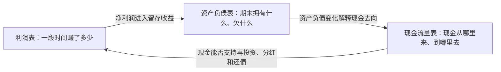

# 统一读表方法：从会计数字走向投资判断

## 1. 财报阅读的四层结构

投资者读财报，不是为了复述收入和利润增速，而是逐层回答四个问题：

1. **业务层**：公司卖什么、卖给谁、凭什么赚钱？
2. **会计层**：这些经营活动怎样被确认为收入、成本、资产和负债？
3. **现金层**：利润最终有没有变成股东可以使用的现金？
4. **估值层**：当前利润是否可持续，市场价格包含了怎样的未来假设？

前三层读错，估值越精细越危险。

## 2. 三张表的关系



可以把三张表理解成：

- 利润表是经营影片；
- 资产负债表是某一帧截图；
- 现金流量表是把利润调整回现金的解释器。

任何单表结论都不完整。例如利润增长可能来自真实销量，也可能伴随应收账款激增；经营现金流很好，可能来自客户预付款，也可能只是拖延支付供应商。

## 3. 三遍阅读法

### 第一遍：15分钟建立地图

只读以下部分：

- 公司主营业务和收入构成；
- 三年主要财务指标；
- 管理层讨论与分析；
- 审计意见和关键审计事项；
- 重大风险提示。

输出不超过五句话：公司如何赚钱、今年发生了什么、利润质量如何、最大的资产负债表风险是什么、下一期最需要验证什么。

### 第二遍：60分钟完成交叉验证

按以下顺序读：

1. 收入、毛利率和分部；
2. 应收账款、存货、合同负债；
3. 经营现金流和购建长期资产现金支出；
4. 有息负债、利息费用和流动性；
5. 减值、商誉、关联交易和或有事项。

这一遍的目标是找到“利润表说得很好，但另外两张表没有配合”的地方。

### 第三遍：形成投资问题

只有在前两遍之后才进入：

- 正常化收入和利润；
- 维持性与扩张性资本开支；
- 可持续ROE或ROIC；
- 情景估值和安全边际；
- 证伪条件。

## 4. 通用指标及其边界

| 指标 | 教学公式 | 能回答什么 | 常见误区 |
|---|---|---|---|
| 净利率 | 归母净利润 / 营业收入 | 每元收入留下多少利润 | 高净利率不自动等于高护城河 |
| 现金转化率 | 经营现金流 / 归母净利润 | 利润是否变成现金 | 单年会受营运资金和金融子公司影响 |
| 自由现金流代理值 | 经营现金流 - 购建长期资产现金支出 | 经营后还剩多少现金 | 未区分维持性与扩张性资本开支 |
| 应收增速差 | 应收账款增速 - 收入增速 | 是否通过放宽信用推动销售 | 需要结合票据、合同资产和坏账准备 |
| 存货增速差 | 存货增速 - 收入增速 | 是否存在积压或备货 | 茅台基酒、资源品和电子产品含义不同 |
| ROE | 归母净利润 / 平均归母净资产 | 股东资本回报 | 可被高杠杆、回购和一次性收益抬高 |
| 资本开支强度 | 购建长期资产现金支出 / 经营现金流 | 企业需要多少再投资 | 高不一定差，关键是未来回报率 |

银行是重要例外。银行的现金流量表不能按制造业逻辑解释，因为吸收存款、发放贷款和金融投资本身就是经营活动。银行应重点看净息差、资产质量、拨备、资本充足率和存款结构。

## 5. 审计报告怎么读

阅读顺序：

1. 审计意见是否为标准无保留；
2. 是否存在持续经营重大不确定性；
3. 关键审计事项是什么；
4. 审计师为何认为这些事项风险高；
5. 对应附注使用了哪些管理层估计。

关键审计事项并不等于财务造假。它告诉你哪里需要重大判断，例如收入确认、固定资产减值、商誉减值或贷款预期信用损失。投资者应把它当作“高风险阅读导航”。

## 6. 半年报不能简单乘以二

半年报通常未经审计，而且受季节性、春节、促销、检修、原材料价格和项目交付节奏影响。正确做法是：

- 与上年同期比较，而不是机械年化；
- 同时看期末资产负债变化；
- 检查下半年是否通常更强或更弱；
- 把管理层年度指引拆成销量、价格、成本和资本开支假设；
- 记录预测，半年报发布后做偏差归因。

## 7. 一页财报学习卡模板

```text
公司 / 报告期：

一、商业模式
- 客户：
- 产品：
- 收费方式：
- 核心成本：
- 竞争优势假设：

二、三年趋势
- 收入：
- 归母净利润：
- 经营现金流：
- ROE / 行业核心指标：

三、利润质量
- 收入增长来自：
- 毛利率变化来自：
- 现金转化率：
- 应收和存货是否异常：

四、资产负债表风险
- 有息负债：
- 减值与商誉：
- 或有负债 / 质保 / 诉讼：

五、未来验证
- 最重要的三个经营变量：
- 下一期必须看到的证据：
- 哪个事实出现后应承认判断错误：
```

## 8. 从财报到投资的最后一道门

财报只能帮助你估计企业价值，不能替你决定买入价格。完成财报分析后，还必须分别处理：

- 未来增长能持续多久；
- 正常化利润是多少；
- 需要投入多少资本才能维持增长；
- 资本成本和周期风险是多少；
- 当前价格隐含了怎样的增长与回报假设。

如果一家公司很好，但估值要求它未来十年持续超预期，它仍可能不是一笔好投资。
