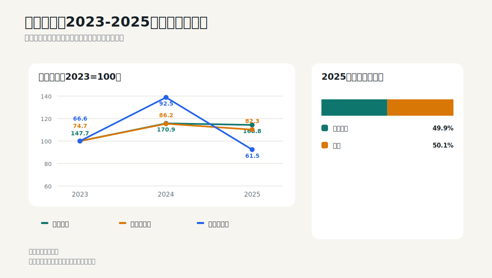
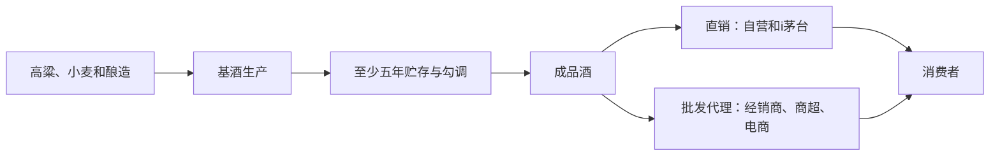

# 贵州茅台：用一瓶酒学会渠道、存货与现金流

## 学习目标

读完本篇，应当能够回答：

- 收入变化如何拆成产品、销量和渠道；
- 为什么茅台的存货不能按普通快消品理解；
- 为什么2025年净利润下降4.5%，经营现金流却下降33.5%；
- 合同负债下降在什么情况下值得警惕；
- 如何从“高毛利”进一步判断品牌和渠道质量。

## 核心判断

2025年不是简单的“茅台突然变差”，而是一个很适合学习的调整年份：收入下降1.2%，归母净利润下降4.5%，系列酒收入下降9.8%，酒类毛利率下降0.78个百分点；与此同时，直销收入增长13.0%，批发代理收入下降12.1%，渠道结构发生明显变化。

经营现金流下降33.5%看起来比利润恶化严重，但年报明确指出，主要受控股财务公司成员单位存款和同业存款变动影响。因此，不能直接得出“利润造假”或“回款崩坏”的结论；应继续拆解销售收现、合同负债和财务公司现金流。



## 1. 先画出商业模式



茅台与普通快消品最大的差异是时间。公司披露，茅台酒从生产到出厂至少需要五年，2025年末库存量中半成品酒和基础酒占绝大部分。因此，存货增长既可能是未来供给，也可能占用资金；不能一看到库存增加就判断滞销。

## 2. 审计报告先告诉了我们什么

2025年财务报告为标准无保留意见。审计师把两项内容列为关键审计事项：

1. 收入确认；
2. 关联方及其交易。

这两项正好对应投资者最应关注的风险点：酒是否在正确期间确认收入，以及集团体系内众多交易是否完整、公允地披露。关键审计事项不是“发现造假”，而是告诉我们这些地方包含较高固有风险和较多判断。

来源：2025年报第53-54页。

## 3. 利润表：先拆产品，再拆渠道

### 3.1 三年总量

| 十亿元 | 2023 | 2024 | 2025 | 2025同比 |
|---|---:|---:|---:|---:|
| 营业收入 | 147.69 | 170.90 | 168.84 | -1.21% |
| 归母净利润 | 74.73 | 86.23 | 82.32 | -4.53% |
| 经营现金流 | 66.59 | 92.46 | 61.52 | -33.46% |
| 加权ROE | 34.19% | 36.02% | 32.53% | -3.49个百分点 |

2025年利润降幅大于收入，意味着不能只解释“卖少了一点”。需要继续看产品结构、毛利率和费用。

### 3.2 产品结构

| 产品 | 2025收入 | 同比 | 毛利率 | 毛利率变化 |
|---|---:|---:|---:|---:|
| 茅台酒 | 146.50 | +0.39% | 93.53% | -0.53个百分点 |
| 其他系列酒 | 22.27 | -9.76% | 76.11% | -3.76个百分点 |

利润压力主要来自系列酒和整体成本上升，而不是核心茅台酒销量突然大幅萎缩。2025年茅台酒销量增长0.73%，系列酒销量增长3.88%，但系列酒收入下降9.76%。

**分析解释：**系列酒出现“销量增、收入降”，通常意味着单价或产品结构下降。可以近似计算：

```text
系列酒平均收入/吨变化 ≈ 0.9024 / 1.0388 - 1 ≈ -13.1%
```

这不是公司披露的直接单价，而是用收入和销量变化做的教学推算。它提示投资者继续核查产品结构和渠道价格。

### 3.3 渠道结构

| 渠道 | 2025收入 | 同比 | 毛利率 | 收入占比 |
|---|---:|---:|---:|---:|
| 直销 | 84.54 | +12.96% | 94.58% | 50.1% |
| 批发代理 | 84.23 | -12.05% | 87.86% | 49.9% |

直销毛利率高于批发代理，而且收入占比已接近一半。这里有两层含义：

- 积极面：公司更接近终端消费者，能够获得更多渠道利润和消费数据；
- 风险面：渠道调整可能影响经销商预付款、库存和价格体系，直销增长也可能带来更多履约和营销成本。

**待验证问题：**直销增长是否来自真实终端动销，而不是渠道迁移？需要结合i茅台收入、批价、经销商数量和合同负债继续判断。

来源：2025年报第10页、第16-17页。

## 4. 资产负债表：存货是护城河还是风险

### 4.1 存货

2025年末存货614.27亿元，同比增长13.0%，占总资产20.2%。公司披露期末酒类库存量33.998万吨，其中成品酒2.477万吨、半成品酒和基础酒31.521万吨。

正确的阅读方法不是简单看“存货/收入”，而是分层：

1. 基础酒是否满足未来年份勾调和产能规划；
2. 成品酒是否积压；
3. 存货成本是否因粮食、人工和制造费用上升而增加；
4. 市场价格和渠道库存是否支持账面价值；
5. 存货增长是否与未来可售产量相匹配。

茅台没有披露存货减值风险提示，并不代表存货没有投资风险。它只说明按会计计量，公司认为成本低于可变现净值。投资者仍需判断未来需求和价格。

### 4.2 合同负债

2025年末合同负债80.07亿元，上年末95.92亿元，下降约16.5%。合同负债主要是预收货款。

合同负债下降可能有三种解释：

- 经销商预付款减少，渠道信心或进货节奏转弱；
- 公司发货节奏变化，期末时点已经把更多预收款转为收入；
- 渠道向直销转移，商业模式对经销商预付款依赖下降。

单个期末数字无法区分三者。正确做法是同时比较经销商数量、批发代理收入、季度收入和下一期合同负债。

来源：2025年报第19页、第102页。

## 5. 现金流量表：先识别财务公司的干扰

| 十亿元 | 2024 | 2025 | 变化 |
|---|---:|---:|---:|
| 归母净利润 | 86.23 | 82.32 | -4.5% |
| 经营现金流 | 92.46 | 61.52 | -33.5% |
| 购建长期资产现金支出 | 4.68 | 3.13 | -33.2% |
| 自由现金流代理值 | 87.78 | 58.39 | -33.5% |

表面上，现金转化率从2024年的1.07倍降至2025年的0.75倍。但公司拥有集团财务公司，现金流量表中还出现：

- 客户存款和同业存放款项净增加额由正110.60亿元变为负50.99亿元；
- 存放中央银行和同业款项净增加额增加；
- 投资支付现金因购买同业存单大幅上升。

这说明合并经营现金流混入了金融业务资金变动。学习重点是：**当公司含有金融子公司时，不能把合并经营现金流直接等同于酒类业务销售收现。**

更稳妥的验证路径：

1. 看销售商品收到的现金与酒类收入；
2. 剔除财务公司存贷款和同业资金变化；
3. 检查合同负债、应收票据和应收账款；
4. 用母公司或酒类主体现金流作补充，而不是只看合并总数。

来源：2025年报第6页、第9页、第13页。

## 6. 从财报走向投资判断

### 可以支持的事实

- 核心茅台酒收入基本稳定；
- 直销占比提升，渠道结构明显变化；
- 系列酒价格或产品结构承压；
- 毛利率和ROE下降；
- 现金流下降包含财务公司资金扰动，不能简单归因于酒卖不动。

### 财报不能单独回答的事情

- 飞天茅台终端成交价和社会库存；
- 直销增长是否真正增加终端消费；
- 渠道改革会不会损害长期品牌稀缺性；
- 当前股价是否已经充分反映低增长或下滑风险。

### 估值时的正确思路

不要直接把2024年高利润外推，也不要只用2025年单年下降判断永久衰退。至少建立三个情景：

- 保守：销量低增长、产品结构继续承压、毛利率缓慢下行；
- 基准：核心酒量稳价稳，系列酒调整结束，直销提高但费用增加；
- 乐观：渠道改革改善终端掌控，产品结构和价格恢复。

然后分别估算正常化利润、分红能力和估值倍数，观察当前价格隐含哪个情景。

## 7. 2026年半年报检查表

- 茅台酒和系列酒的收入、销量及推算吨价；
- 直销与批发代理收入增速、毛利率；
- i茅台收入和经销商数量；
- 合同负债相对上年同期和上年末的变化；
- 成品酒与基础酒库存结构；
- 剔除财务公司影响后的销售收现；
- 毛利率、销售费用率和ROE是否继续下降。

## 8. 练习题

1. 为什么“存货增长13%”不能直接证明滞销？
2. 系列酒销量增长、收入下降意味着什么？
3. 为什么2025年经营现金流不能直接与酒类利润一一对应？
4. 直销占比提高一定会增加股东价值吗？还需要验证什么？

<details>
<summary>参考答案</summary>

1. 茅台存货主体是需要多年贮存和勾调的基础酒，必须拆分成品酒与半成品酒，并结合未来产销规划判断。
2. 通常意味着平均售价或产品结构下降；按收入和销量变化近似推算，系列酒平均收入/吨明显下降。
3. 合并报表包含集团财务公司，成员单位存款、同业存款和贷款变动会进入经营现金流。
4. 不一定。还需验证终端动销、渠道费用、履约成本、经销体系稳定性、价格体系和品牌稀缺性。

</details>

## 主要来源

- 贵州茅台2025年年度报告：第6页主要指标；第10页分产品和渠道毛利率；第13页现金流；第16-17页产品与渠道；第19页资产结构；第53-54页关键审计事项；第102页合同负债。
- [官方财报PDF](https://static.cninfo.com.cn/finalpage/2026-04-17/1225114741.PDF)
