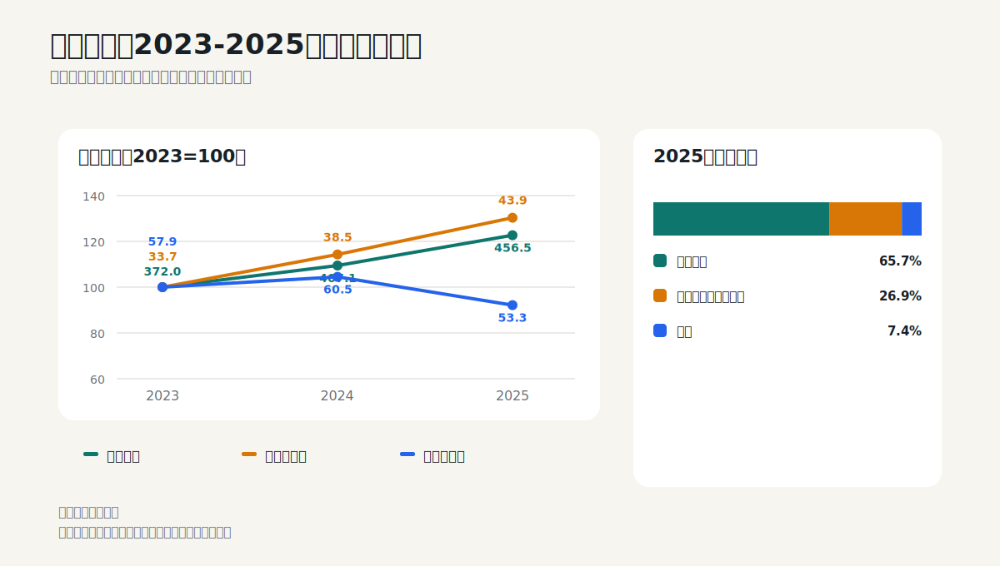
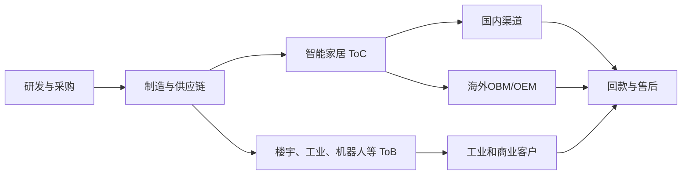

# 美的集团：用制造业学会营运资金、分部和商誉

## 学习目标

读完本篇，应当能够：

- 区分收入增长、利润增长和现金增长；
- 用应收账款、存货、合同负债检查制造业增长质量；
- 阅读多元化公司的分部和地区结构；
- 理解并购商誉为什么是“未来兑现承诺”；
- 计算自由现金流代理值，并知道它的局限。

## 核心判断

2025年美的收入增长12.1%、归母净利润增长14.0%，海外、商业及工业解决方案和线上渠道增长更快，增长来源相对多元。主要业务毛利率基本稳定，利润增长不是靠毛利率突然抬升。

需要继续追问的是现金：经营现金流下降11.8%，购建长期资产现金支出增长42.1%，自由现金流代理值从约526.7亿元降至422.0亿元。应收账款增速略高于收入，商誉增长至342.6亿元。这不等于财务质量恶化，但提示增长、并购和资本投入对现金提出了更高要求。



## 1. 商业模式比“家电公司”更复杂



制造业的现金循环通常是：先采购和生产，形成存货；销售后形成现金、应收账款或票据；对供应商形成应付账款；再把现金投入研发、设备和并购。

因此，美的不能只看“收入增长多少”，还要看增长占用了多少营运资金和长期资本。

## 2. 审计报告提供的阅读导航

2025年财务报告为标准无保留意见。审计师列出两项关键审计事项：

1. 智能家居业务收入确认；
2. KUKA集团及TLSC集团商誉减值测试。

第一项说明销售渠道多、客户数量大、退货和返利条款复杂；第二项说明并购形成的商誉金额重大，减值测试依赖收入增速、毛利率、永续增长率和折现率等管理层假设。

来源：2025年报第125-127页。

## 3. 利润表：增长来自哪里

### 3.1 三年总量

| 十亿元 | 2023 | 2024 | 2025 | 2025同比 |
|---|---:|---:|---:|---:|
| 营业收入 | 372.04 | 407.15 | 456.45 | +12.11% |
| 归母净利润 | 33.72 | 38.54 | 43.95 | +14.03% |
| 扣非归母净利润 | 32.97 | 35.74 | 41.27 | +15.46% |
| 经营现金流 | 57.90 | 60.51 | 53.35 | -11.84% |
| 加权ROE | 22.23% | 21.29% | 19.70% | -1.59个百分点 |

收入和利润增长，但ROE继续下降。原因不能仅凭一张表确认，但可以提出两类假设：净资产扩张速度超过利润增长，或新增资本的回报率低于历史水平。后续应把H股融资、并购和留存利润纳入分析。

### 3.2 产品结构

| 业务 | 2025收入 | 同比 | 毛利率 | 2025收入占比 |
|---|---:|---:|---:|---:|
| 智能家居 | 299.93 | +11.28% | 29.90% | 65.7% |
| 商业及工业解决方案 | 122.75 | +17.47% | 20.81% | 26.9% |
| 其他 | 33.77 | +1.96% | 15.53% | 7.4% |

商业及工业解决方案增长更快，但毛利率低于智能家居。收入结构向ToB迁移不保证集团利润率上升，关键要看规模效应、资本占用和并购整合。

细分业务中，楼宇科技收入增长25.7%、毛利率30.58%；机器人与自动化收入增长8.1%、毛利率21.31%；工业技术收入增长10.2%、毛利率17.50%。不同细分业务的经济质量明显不同，不宜把ToB整体视作一个产品。

### 3.3 地区与渠道

| 维度 | 2025收入 | 同比 | 毛利率 |
|---|---:|---:|---:|
| 国内 | 260.50 | +9.40% | 26.24% |
| 海外 | 195.95 | +15.92% | 26.60% |
| 线上 | 101.04 | +18.01% | 30.84% |
| 线下 | 355.41 | +10.54% | 25.13% |

海外收入占比42.9%，意味着汇率、关税、海外产能、品牌投入和地缘风险已是核心经营变量。线上毛利率较高，但仍要确认是否包含不同产品结构，不能直接把渠道差异全部解释为效率优势。

来源：2025年报第48-50页。

## 4. 资产负债表：增长有没有占用更多资金

| 十亿元 | 2024年末 | 2025年末 | 增幅 | 与收入增速比较 |
|---|---:|---:|---:|---|
| 应收账款 | 35.80 | 40.45 | +13.0% | 略高于收入增速 |
| 存货 | 63.34 | 64.63 | +2.0% | 明显低于收入增速 |
| 合同负债 | 49.25 | 46.99 | -4.6% | 预收款减少 |
| 固定资产 | 33.53 | 44.98 | +34.2% | 长期投入增加 |
| 商誉 | 29.58 | 34.26 | +15.8% | 并购影响上升 |
| 短期借款 | 31.01 | 43.90 | +41.6% | 融资增加 |
| 长期借款 | 10.49 | 12.66 | +20.7% | 融资增加 |

### 4.1 营运资金的初步判断

- 应收账款增速略高于收入，需要继续看账龄、坏账准备和客户结构；
- 存货增速明显低于收入，表面上存货效率改善；
- 合同负债下降，说明期末客户预付款提供的融资减少；
- 三者合并看，比只看存货更完整。

不能据此直接判断营运资金改善或恶化，因为还需要应付账款、票据、合同资产和季节性数据。但这张表已经告诉投资者，现金流下降不能简单归因于“库存积压”。

### 4.2 商誉的正确读法

2025年末商誉342.57亿元，其中KUKA相关商誉约234.35亿元。管理层测试后认为无需减值。

商誉本身不是现金，也不产生回报。它代表收购价超过可辨认净资产公允价值的部分。投资者应追踪：

1. 被收购业务实际收入和利润是否达到收购时预期；
2. 现金流预测是否反复下调；
3. 折现率和永续增长率是否过于乐观；
4. 商誉占净资产和利润的比例；
5. 即使会计上不减值，经济回报率是否低于资本成本。

## 5. 现金流量表：利润增长为什么没有同步转成现金

| 十亿元 | 2024 | 2025 | 变化 |
|---|---:|---:|---:|
| 归母净利润 | 38.54 | 43.95 | +14.0% |
| 经营现金流 | 60.51 | 53.35 | -11.8% |
| 购建长期资产现金支出 | 7.84 | 11.14 | +42.1% |
| 自由现金流代理值 | 52.67 | 42.20 | -19.9% |

2025年现金转化率约1.21倍，绝对水平仍高于1，但同比明显下降。这里必须避免两个错误：

- 错误一：现金流高于净利润，所以完全没有问题；
- 错误二：经营现金流下降，所以收入一定有问题。

正确做法是把现金流拆成：经营利润、折旧摊销、营运资金变动、税费、其他经营现金流。还要注意美的投资活动中大量收回和购买理财或金融投资，投资现金流转正不等于主营业务突然创造了额外自由现金。

来源：2025年报第52页、现金流量表附注。

## 6. 研发与资本配置

2025年研发投入177.88亿元，同比增长9.6%，占收入3.90%，比2024年下降0.09个百分点。研发绝对额增长，但增速低于收入。

投资者应把研发、资本开支、并购和股东回报放在一张资本配置表中：

```text
经营现金流
- 维持性资本开支
- 扩张性资本开支
- 并购净支出
- 偿债
- 分红与回购
= 现金与金融资产变化
```

2025年公司同时发生并购、债务偿还、分红和大额回购。评价管理层不能只看“回购金额大”，还要问回购价格是否低于内在价值，以及并购业务是否获得足够回报。

## 7. 从财报走向投资判断

### 财报支持的事实

- 收入和利润保持双位数增长；
- 海外和ToB增长快于集团；
- 核心业务毛利率总体稳定；
- 应收增速略高于收入，存货增速较低；
- 经营现金流和自由现金流代理值下降；
- 商誉、固定资产和借款增加，资本结构更复杂。

### 关键投资问题

- 海外增长是否依赖短期渠道扩张，还是形成品牌和本地化能力；
- ToB业务增长是否能提高集团ROIC，而不仅是提高收入；
- KUKA和其他收购是否逐步兑现协同；
- 经营现金流下降是短期营运资金波动，还是增长模式变得更耗现金；
- ROE下降会在什么水平稳定。

### 估值提示

多业务公司不宜只用一个集团PE。可以使用分部思路：

- 智能家居：成熟现金流和品牌业务；
- 楼宇、工业技术、机器人：增速与资本回报差异较大；
- 净现金或净债务、金融投资和少数股东权益单独调整；
- 商誉不应简单视为可变现资产。

## 8. 2026年半年报检查表

- 智能家居、楼宇、机器人和工业技术收入及毛利率；
- 海外收入、OBM占比和海外利润率；
- 应收、存货、合同负债相对收入的变化；
- 经营现金流和购建长期资产现金支出；
- KUKA等被收购业务的经营表现；
- 商誉、借款和利息费用；
- ROE与自由现金流代理值是否企稳。

## 9. 练习题

1. 为什么2025年收入和利润增长，经营现金流却可能下降？
2. 存货增速低于收入是否足以证明营运资金改善？
3. 为什么投资活动现金流转正不能直接当作主营业务自由现金流？
4. 商誉未减值是否等于并购成功？

<details>
<summary>参考答案</summary>

1. 营运资金、税费、应付项目和其他经营现金变化都可能造成差异，需要看现金流附注。
2. 不足。还应看应收、应付、票据、合同资产和合同负债，以及季节性。
3. 大量理财和金融投资的赎回也会产生投资现金流入，与主营业务经营能力不同。
4. 不等于。会计减值测试只说明按当前模型可收回金额不低于账面价值，仍需比较实际回报率与资本成本。

</details>

## 主要来源

- 美的集团2025年年度报告：第8页主要指标；第48-50页收入与毛利率；第51-53页现金流和资产结构；第54页研发；第125-127页关键审计事项；财务报表附注商誉与现金流量表。
- [官方财报PDF](https://www.midea.com.cn/content/dam/mideacn-aem/%E6%8A%95%E8%B5%84%E8%80%85%E5%85%B3%E7%B3%BB/2025%E5%B9%B4%E5%BA%A6%E6%8A%A5%E5%91%8A.pdf.coredownload.inline.pdf)
