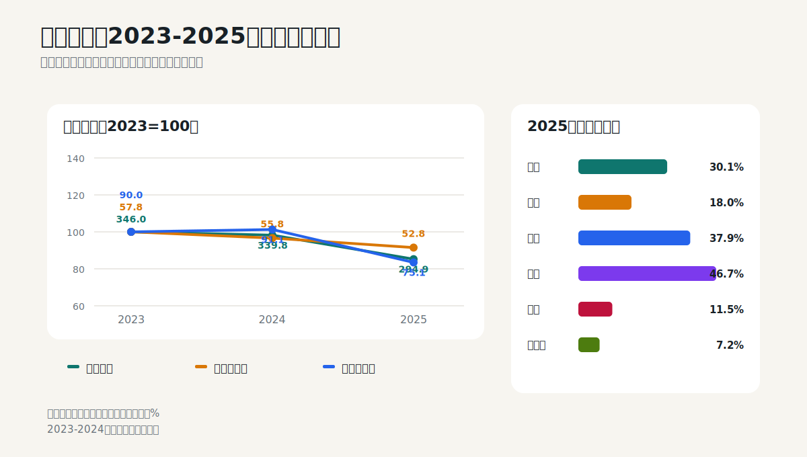
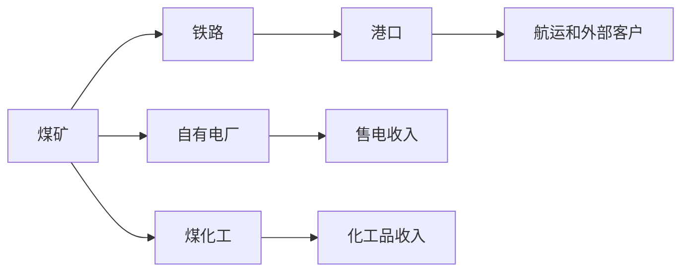

# 中国神华：用周期股学会量价成本、正常化利润和资本开支

## 学习目标

读完本篇，应当能够：

- 把资源企业收入拆成销量、价格和产品结构；
- 理解一体化经营为什么能平滑周期，但不能消除周期；
- 区分报告净利润、扣非净利润和正常化利润；
- 用资本开支和折旧判断重资产企业的现金含量；
- 不再用单年低PE机械判断周期股“便宜”。

## 核心判断

2025年中国神华营业收入下降13.2%，但归母净利润只下降5.3%。主要原因不是需求完全稳定，而是煤炭销售量下降6.4%、平均售价下降12.1%的同时，外购煤成本、自产煤单位成本和部分资产减值压力下降，一体化运输和发电业务也提供了缓冲。

更值得警惕的是扣非归母净利润下降19.2%，明显弱于报告净利润。周期股应优先分析主营正常利润，不应被一次性损益或资产处置抬高的报告利润误导。



## 1. 一体化商业模式



神华不只是煤矿。煤炭可以通过自有铁路和港口运输，也可以供应自有电厂或煤化工业务。内部交易在分部层面体现利润，但合并报表必须抵销，所以分部收入不能直接相加得到集团收入。

一体化的经济价值包括：

- 降低运输瓶颈和外部运价波动；
- 把煤炭利润部分转移到运输和发电环节；
- 在煤价下行时，发电燃料成本可能受益；
- 但煤价、用电量、利用小时和电价仍会影响整体利润。

## 2. 审计报告给出的高风险阅读区

2025年财务报告为标准无保留意见。关键审计事项包括：

1. 固定资产、在建工程和无形资产减值评估；
2. 煤炭销售收入确认时点。

第一项覆盖的长期资产账面价值约3752.91亿元，减值测试依赖未来销量、价格、资本支出、经营成本和折现率；第二项说明不同煤炭销售合同的控制权转移条款不同，存在收入跨期风险。

这说明重资产周期企业最重要的会计判断之一，是未来现金流能否支持巨额资产账面价值。

来源：2025年报第140-143页。

## 3. 利润表：必须拆成量、价、成本

### 3.1 三年总量

| 十亿元 | 2023重述 | 2024重述 | 2025 | 2025同比 |
|---|---:|---:|---:|---:|
| 营业收入 | 345.95 | 339.79 | 294.92 | -13.2% |
| 归母净利润 | 57.76 | 55.81 | 52.85 | -5.3% |
| 扣非归母净利润 | 62.87 | 60.13 | 48.59 | -19.2% |
| 经营现金流 | 89.95 | 91.09 | 75.06 | -17.6% |
| 加权ROE | 14.52% | 13.55% | 12.76% | -0.79个百分点 |

2025年完成收购杭锦能源并对比较期进行重述，因此必须使用年报“重述后”数据比较。若把2025年与原披露的2024年直接比较，会把合并范围变化误认为经营变化。

### 3.2 煤炭收入拆解

| 变量 | 2024重述 | 2025 | 同比 |
|---|---:|---:|---:|
| 商品煤产量（百万吨） | 337.9 | 332.1 | -1.7% |
| 煤炭销售量（百万吨） | 460.2 | 430.9 | -6.4% |
| 平均销售价格 | - | - | -12.1% |
| 自产煤单位生产成本（元/吨） | 180.2 | 171.6 | -4.8% |

煤炭销售收入的近似关系为：

```text
煤炭收入 ≈ 销量 × 平均售价
```

销量下降6.4%、售价下降12.1%，两者共同导致煤炭分部收入下降17.7%。不能只说“煤价跌了”，也不能只看产量，因为公司还有外购煤销售和库存变化。

### 3.3 自产煤与外购煤不是同一种利润

| 煤源 | 2025收入 | 2025毛利率 | 2024毛利率 |
|---|---:|---:|---:|
| 自产煤 | 156.91 | 40.0% | 43.9% |
| 外购煤 | 56.24 | 1.1% | 2.1% |

外购煤收入规模不小，但毛利率很低。仅看销售量会高估经济价值。投资者更应关注自产煤销量、售价和单位成本。

### 3.4 分部毛利率

| 分部 | 2025收入（抵销前） | 毛利率 | 同比变化 |
|---|---:|---:|---:|
| 煤炭 | 221.23 | 30.1% | -0.1个百分点 |
| 发电 | 89.14 | 18.0% | +1.9个百分点 |
| 铁路 | 43.71 | 37.9% | +0.1个百分点 |
| 港口 | 7.02 | 46.7% | +6.0个百分点 |
| 航运 | 3.99 | 11.5% | +0.7个百分点 |
| 煤化工 | 5.72 | 7.2% | +1.4个百分点 |

煤价下降时，发电分部毛利率改善，体现了一体化的缓冲作用；铁路和港口仍提供较高毛利。但这不代表集团利润与煤价脱钩，因为煤炭仍是主要利润来源。

来源：2025年报第20-23页、第29-30页。

## 4. 正常化利润：周期股最重要的一步

报告归母净利润528.49亿元，扣非归母净利润485.89亿元，相差42.60亿元。投资者不应自动把全部差异删除，也不应全部保留，而要逐项分类：

- 是否真正一次性；
- 是否与主营资产处置相关；
- 是否会在周期中反复出现；
- 是否对应真实现金流；
- 是否应计入正常资本回报。

估计正常化利润时，应使用一个完整周期内的：

```text
正常化利润
= 正常销量 × 正常煤价
- 正常单位成本
+ 运输、电力等正常分部利润
- 维持性折旧和税费
- 正常管理与融资费用
```

不能把当前高煤价年份的利润永久化，也不能把周期低点当成永续利润。

## 5. 资产负债表：低杠杆不等于没有风险

2025年末资产总额6277.61亿元、负债1463.10亿元，资产负债率23.3%，总债务资本比6.8%。财务杠杆相对低，短期偿债压力不是主要矛盾。

真正的资产负债表风险来自：

- 巨额固定资产、在建工程和矿业权是否具备足够未来现金流；
- 资源储量和可采年限；
- 环保、安全和复垦义务；
- 在建项目投产后的利用率；
- 同一控制下资产注入和重大重组的估值与协同。

这也是审计师把长期资产减值列为关键审计事项的原因。

## 6. 现金流与资本开支

| 十亿元 | 2024重述 | 2025 | 变化 |
|---|---:|---:|---:|
| 归母净利润 | 55.81 | 52.85 | -5.3% |
| 经营现金流 | 91.09 | 75.06 | -17.6% |
| 购建长期资产现金支出 | 37.71 | 48.40 | +28.4% |
| 自由现金流代理值 | 53.38 | 26.66 | -50.1% |

2025年现金转化率约1.42倍，但资本开支强度约64.5%。这说明利润的现金含量尚可，但重资产扩张消耗大量现金。

公司另披露2025年完成资本开支446.86亿元，不含矿业权支出；现金流量表的购建长期资产现金支出为483.98亿元。两者不同并不必然矛盾，可能来自统计口径、付款时点和资产范围差异。教学上，计算现金流代理值应采用现金流量表数字；分析项目计划时使用公司资本开支口径。

2026年资本开支计划380.23亿元，不含矿业权支出。投资者需要区分：

- 维持性资本开支：维持现有产能、安全和环保要求；
- 扩张性资本开支：新矿、新电厂、铁路港口扩建；
- 战略性资本开支：新能源和煤化工布局。

只有超过维持性资本开支之后的现金，才更接近可持续分红能力。

来源：2025年报第46-47页、第160-161页。

## 7. 分红：高股息必须经过周期检验

公司制定2025-2027年股东回报规划，年度最低分红比例提升至归母净利润的65%；2025年中期及拟派末期股息合计预计占全年归母净利润79.1%。

高分红有价值，但不能只看当期股息率。需要检查：

```text
可持续分红
≤ 正常化经营现金流
- 维持性资本开支
- 必要偿债
- 安全现金储备增加
```

若煤价下行、资本开支上升或重大资产重组需要资金，高分红比例可能与绝对分红金额下降同时发生。

## 8. 从财报走向投资判断

### 财报支持的事实

- 煤炭销量和价格均下降；
- 自产煤单位成本下降，缓冲利润；
- 发电和运输分部提供一体化稳定性；
- 扣非利润下降快于报告利润；
- 经营现金流下降、长期资产现金支出上升；
- 杠杆低，但长期资产和资源价值判断重大。

### 关键投资问题

- 当前煤价处于周期什么位置；
- 未来自产煤销量和单位成本；
- 发电利用小时、电价和燃料成本；
- 新项目的资本回报率；
- 资产注入会增加多少利润、资本和少数股东权益；
- 分红是否由正常自由现金流覆盖。

### 估值提示

周期股至少使用两套方法交叉验证：

- 正常化利润乘以保守倍数；
- 资源和分部资产价值，扣除必要资本开支、负债和环境义务。

当现货价格处于高位时，低PE可能只是高利润导致的分母暂时变大。

## 9. 2026年半年报检查表

- 自产煤产量、煤炭销量和平均售价；
- 自产煤单位生产成本；
- 发电量、售电量、平均电价和利用小时；
- 各分部毛利率与合并抵销；
- 经营现金流、资本开支完成额和矿业权支出；
- 扣非与报告净利润差异；
- 重大资产重组进展和报表口径变化；
- 分红与自由现金流覆盖程度。

## 10. 练习题

1. 为什么煤炭销量下降6.4%不能完整解释收入下降17.7%？
2. 为什么外购煤销售量不能与自产煤销售量等价看待？
3. 归母净利润只下降5.3%，为什么仍应重视扣非净利润下降19.2%？
4. 公司资本开支口径与现金流量表购建长期资产支出为什么可能不同？

<details>
<summary>参考答案</summary>

1. 平均售价同时下降12.1%，收入由量和价共同决定。
2. 外购煤毛利率约1.1%，自产煤毛利率约40%，经济价值完全不同。
3. 报告利润受到非经常性损益支持，主营正常利润下降更快，估值应关注可持续部分。
4. 统计范围、项目确认和付款时点不同；现金流分析采用现金流量表，项目计划分析采用公司资本开支披露。

</details>

## 主要来源

- 中国神华2025年年度报告：第8-9页主要指标；第20-23页量价成本和分部；第29-30页自产煤成本与毛利；第46-47页资本开支；第140-143页关键审计事项；第160-161页现金流量表。
- [官方财报PDF](https://www.shenhuachina.com/zgshww/dqbg/202603/86d1e5e489da4f94a1a5c885877860c9/files/a7e442c35d52455bb9fd58a97c422c1e.pdf)
