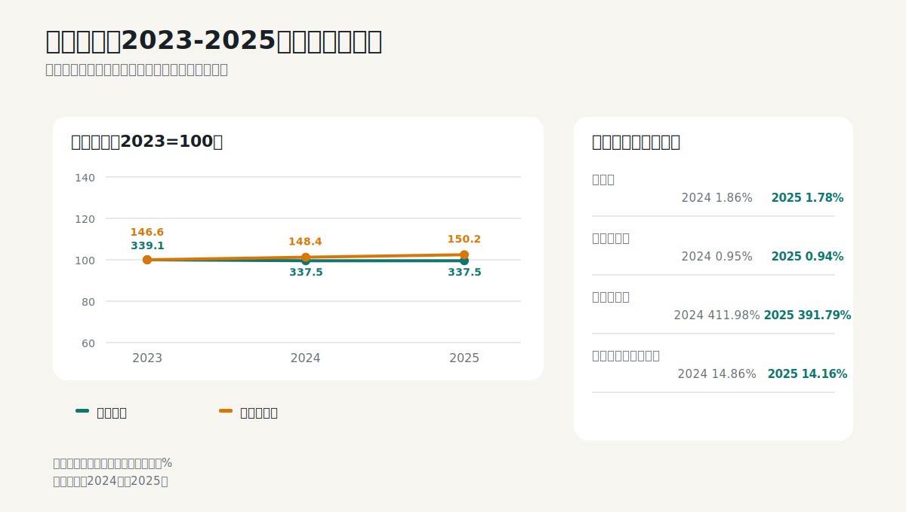
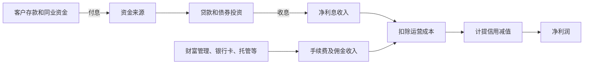

# 招商银行：银行财报必须换一套语言

## 学习目标

读完本篇，应当能够：

- 理解银行资产负债表就是主要“生产系统”；
- 区分净利差、净息差和净利息收入；
- 联合分析不良率、拨备覆盖率、贷款拨备率和信用成本；
- 理解资本充足率为什么会限制增长；
- 知道为什么银行不能套用普通制造业自由现金流。

## 核心判断

2025年招商银行营业收入基本持平，归母净利润增长1.2%。贷款增长5.4%、存款增长8.1%，净利息收入增长2.0%，但净息差从1.86%降至1.78%，ROE从14.49%降至13.44%。这是一幅“规模增长抵消单位利差下降”的典型银行图景。

不良贷款率从0.95%降至0.94%，但不良余额增长4.0%；拨备覆盖率从411.98%降至391.79%，贷款拨备率从3.92%降至3.68%。资产质量表面稳定，但风险抵补垫有所下降，需要和逾期、关注类贷款、不良生成率、信用成本一起看。



## 1. 银行怎么赚钱



普通制造业把存货变成产品，银行把资金配置成贷款和投资。对银行而言：

- 存款是重要低成本资金来源；
- 贷款和投资是主要生息资产；
- 信用减值是“坏产品成本”；
- 资本金是吸收损失并支持资产扩张的约束。

因此，银行资产负债表不是利润表的附属品，而是利润来源本身。

## 2. 审计报告最关注什么

2025年财务报告为标准无保留意见。关键审计事项包括：

1. 贷款和垫款的预期信用损失；
2. 结构化主体的合并。

贷款预期信用损失需要判断信用风险是否显著增加、违约概率、违约损失率、未来宏观情景和抵押物回收价值。结构化主体则涉及理财产品、资管计划、信托、资产证券化和基金等是否由银行控制、是否应纳入合并报表。

这两项分别对应银行最重要的风险：资产质量估计和表内外边界。

来源：2025年报审计报告第1-4页。

## 3. 利润表：收入不增长，利润为什么还能增长

### 3.1 三年总量

| 十亿元 | 2023 | 2024 | 2025 | 2025同比 |
|---|---:|---:|---:|---:|
| 营业收入 | 339.12 | 337.49 | 337.53 | +0.01% |
| 归母净利润 | 146.60 | 148.39 | 150.18 | +1.21% |
| 净利息收入 | - | 211.28 | 215.59 | +2.04% |
| 非利息净收入 | - | 126.21 | 121.94 | -3.38% |
| 加权ROE | 16.22% | 14.49% | 13.44% | -1.05个百分点 |

净利润增长快于收入，可能来自成本控制、信用减值、税率和业务结构。不能只看利润增速，需要继续判断信用成本是否被过度压低，以及资产质量是否为未来埋下成本。

ROE连续下降说明净资产增长快于利润。银行估值的核心不是“利润还在增长”，而是长期ROE能否高于股权资本成本。

### 3.2 净息差的含义

```text
净利息收入 = 生息资产利息收入 - 计息负债利息支出

净息差（NIM）≈ 净利息收入 / 平均生息资产

净利差 ≈ 生息资产收益率 - 计息负债成本率
```

| 指标 | 2024 | 2025 | 变化 |
|---|---:|---:|---:|
| 净息差 | 1.86% | 1.78% | -8个基点 |
| 净利差 | 1.98% | 1.87% | -11个基点 |
| 贷款和垫款总额 | 6.888万亿元 | 7.258万亿元 | +5.37% |
| 客户存款总额 | 9.097万亿元 | 9.836万亿元 | +8.13% |

净息差下降，但资产规模增长，使净利息收入仍增长。这个模式能否持续取决于：

- 贷款需求和资产收益率；
- 存款定期化程度和成本；
- 低收益金融投资占比；
- 竞争和利率政策；
- 风险加权资产消耗。

存款增长快于贷款是流动性和资金来源的积极信号，但还要看活期存款、核心存款和高成本定期存款的结构。

来源：2025年报第13-14页、第21页。

## 4. 资产质量：四个指标必须一起看

| 指标 | 2024 | 2025 | 表面变化 |
|---|---:|---:|---|
| 不良贷款余额 | 656.10亿元 | 682.06亿元 | +3.96% |
| 不良贷款率 | 0.95% | 0.94% | -0.01个百分点 |
| 拨备覆盖率 | 411.98% | 391.79% | -20.19个百分点 |
| 贷款拨备率 | 3.92% | 3.68% | -0.24个百分点 |

### 4.1 为什么不良率下降但不良余额上升

```text
不良贷款率 = 不良贷款余额 / 贷款总额
```

贷款总额增长快于不良余额时，不良率可以下降。比例改善不等于风险金额减少。

### 4.2 拨备覆盖率怎么理解

```text
拨备覆盖率 = 贷款损失准备 / 不良贷款余额
贷款拨备率 = 贷款损失准备 / 贷款总额
```

拨备覆盖率仍处于高位，但同比下降。下降可能来自不良增长、拨备释放、核销和风险结构变化。投资者不能只说“391%很安全”，还应分析：

- 关注类、逾期和重组贷款；
- 新生成不良与核销；
- 房地产、信用卡、小微和地方相关敞口；
- 第1、2、3阶段贷款迁徙；
- 信用成本与宏观环境是否匹配。

### 4.3 预期信用损失为什么主观

银行不是等贷款真正违约后才计提损失，而是根据未来违约概率和损失率提前计提。宏观情景权重、抵押物价值和贷款分类都会影响当期利润。因此，银行净利润既是经营结果，也是风险估计结果。

来源：2025年报第31页、贷款和垫款及风险管理附注。

## 5. 资本充足率：增长不是免费的

| 指标 | 2024 | 2025 | 变化 |
|---|---:|---:|---:|
| 核心一级资本充足率 | 14.86% | 14.16% | -0.70个百分点 |
| 一级资本充足率 | 17.48% | 16.51% | -0.97个百分点 |
| 资本充足率 | 19.05% | 18.24% | -0.81个百分点 |
| 风险加权资产 | 6.886万亿元 | 7.540万亿元 | +9.50% |

核心一级资本净额增长，但风险加权资产增长更快，因此比率下降。银行扩大贷款或配置高风险权重资产时，会消耗资本。

资本充足率影响：

- 能否继续扩张资产；
- 是否需要留存更多利润；
- 分红能力；
- 是否需要发行普通股、永续债或二级资本债；
- 高ROE能否持续。

来源：2025年报资本管理附注。

## 6. 为什么不分析银行自由现金流

制造业的经营现金流通常代表销售收现减采购等支出；银行的现金流会被存款流入、贷款投放、金融投资买卖大幅影响，而这些正是主营业务。

因此，以下指标对银行更有效：

- 净利息收入和净息差；
- 存贷款规模与结构；
- 信用成本和不良生成；
- 拨备与资本；
- ROA、ROE和每股净资产；
- 分红后资本内生增长能力。

若机械计算“经营现金流/净利润”，结论通常没有经济意义。

## 7. 非息收入和财富管理

2025年非利息净收入下降3.38%，抵消了净利息收入增长。对零售和财富管理见长的银行，非息收入可以降低对息差的依赖，但它也受资本市场、产品费率、客户风险偏好和监管影响。

需要区分：

- 手续费及佣金收入是否可持续；
- 投资收益和公允价值变动是否具有波动性；
- 理财产品是否在表外、银行是否承担隐性支持；
- AUM增长有没有转化成收入和利润。

## 8. 从财报走向投资判断

### 财报支持的事实

- 收入基本持平，利润小幅增长；
- 资产和存贷款继续扩张；
- 净息差下降，但净利息收入靠规模增长；
- 不良率稳定，不良余额上升；
- 拨备和资本比率下降；
- ROE继续下行。

### 关键投资问题

- 净息差何时企稳；
- 存款成本下降能否继续对冲资产收益率下降；
- 不良生成、关注类和逾期贷款是否恶化；
- 财富管理和手续费收入何时恢复；
- 风险加权资产增长会不会迫使银行降低分红或补充资本；
- 长期可持续ROE是多少。

### 估值提示

银行常用市净率，但不能孤立看PB。一个简化关系是：

```text
合理PB取决于：长期ROE、股权资本成本、增长率和分红率
```

当长期ROE低于股权资本成本时，低PB可能合理；当ROE高且可持续、资产质量真实，PB才更有向上基础。

## 9. 2026年半年报检查表

- 净利息收入、净息差和净利差；
- 贷款收益率、存款成本率和活期存款占比；
- 贷款、存款和风险加权资产增速；
- 不良余额、不良率、关注类、逾期和不良生成率；
- 信用成本、拨备覆盖率和贷款拨备率；
- 手续费、财富管理AUM和非息收入；
- 核心一级资本充足率和分红影响；
- ROA和ROE。

## 10. 练习题

1. 不良率下降为什么不代表不良余额下降？
2. 净息差下降时，净利息收入为什么仍可能增长？
3. 拨备覆盖率很高，为什么仍需看关注类和逾期贷款？
4. 为什么银行不能用制造业自由现金流估值？

<details>
<summary>参考答案</summary>

1. 贷款总额增长快于不良余额时，比率会下降。
2. 生息资产规模扩大可以抵消单位利差下降。
3. 不良分类可能滞后，关注类和逾期能提供风险迁徙的领先线索，拨备也受模型和管理层假设影响。
4. 存贷款和金融投资是银行主营业务，普通现金流分类不能分离经营与融资活动。

</details>

## 主要来源

- 招商银行2025年年度报告：第7页核心指标；第13-14页三年财务数据；第21页净息差；第31页贷款质量；资本管理、贷款和垫款、风险管理附注；审计报告第1-4页。
- [中国货币网正式年报页面](https://www.chinamoney.com.cn/chinese/cwbg/20260401/3308334.html)
- [招商银行2025年度业绩快报](https://s3gw.cmbchina.com/lb5001-cmbweb-prd-1255000097/cmbir/20260123/721c99c0-1b86-47f7-ab46-e4b6aa68da0e.pdf)
