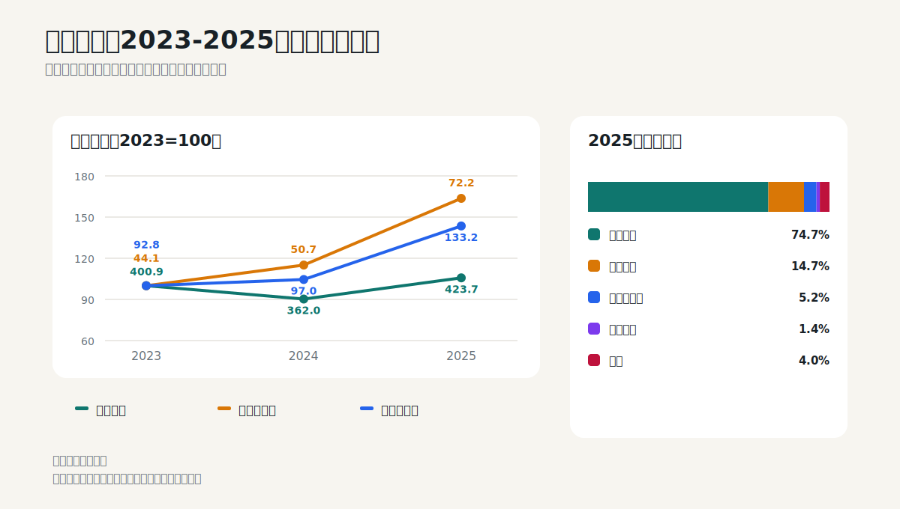
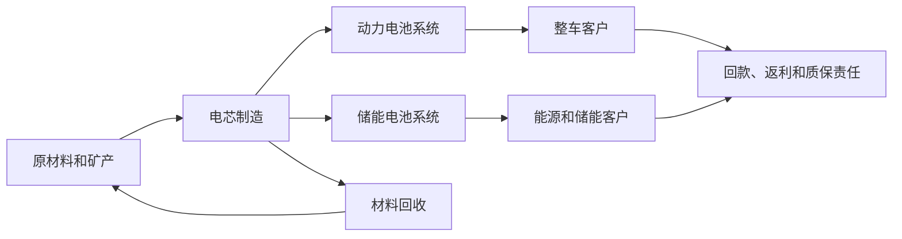

# 宁德时代：成长、扩产、存货和质保必须同时看

## 学习目标

读完本篇，应当能够：

- 区分成长制造业的收入增长与资本效率；
- 通过产品结构和毛利率判断增长质量；
- 分析存货、固定资产、在建工程和减值；
- 理解质保预计负债为什么是电池企业的重要经济成本；
- 判断高经营现金流是否足以覆盖扩产和股东回报。

## 核心判断

2025年宁德时代收入增长17.0%、归母净利润增长42.3%、经营现金流增长37.4%，利润和现金增速均快于收入，整体经营结果强劲。动力电池收入增长25.1%，境外收入增长17.5%，经营现金流达到1332.20亿元。

但成长不等于没有风险：存货账面价值增长58.0%，固定资产增长30.0%，全年新增固定资产减值26.60亿元，售后综合服务费预计负债达到512.33亿元。投资者必须同时看增长、扩产、存货减值和长期质保成本。



## 1. 商业模式和现金循环



电池企业的利润不仅取决于出货量，还取决于：

- 单位售价和原材料价格传导；
- 产能利用率与良率；
- 产品代际和客户结构；
- 海内外产能成本；
- 售后质保和返利；
- 研发、设备和供应链投入。

## 2. 审计报告给出的高风险区域

2025年财务报告为标准无保留意见。关键审计事项包括：

1. 固定资产减值；
2. 收入确认。

2025年末固定资产账面价值1464.01亿元，当年新增固定资产减值26.60亿元。减值测试涉及资产组、产能利用率、未来现金流和设备闲置情况。收入确认则涉及合同条款、返利、客户确认和截止测试。

这两项说明成长制造业的两个主要财报风险：收入是否在正确期间确认，以及快速扩张形成的设备能否产生足够回报。

来源：2025年报第107-108页。

## 3. 利润表：增长质量要拆产品和地区

### 3.1 三年总量

| 十亿元 | 2023 | 2024 | 2025 | 2025同比 |
|---|---:|---:|---:|---:|
| 营业收入 | 400.92 | 362.01 | 423.70 | +17.04% |
| 归母净利润 | 44.12 | 50.74 | 72.20 | +42.28% |
| 扣非归母净利润 | 40.09 | 44.99 | 64.51 | +43.37% |
| 经营现金流 | 92.83 | 96.99 | 133.22 | +37.35% |
| 加权ROE | 24.04% | 24.13% | 24.91% | +0.78个百分点 |

2024年收入下降但利润增长，2025年收入恢复并带动利润加速。这个三年序列提醒投资者：电池收入会受到价格和原材料下降影响，收入下降不必然等于出货量下降；需要把量、价、成本和产品结构拆开。

### 3.2 产品结构

| 产品 | 2025收入 | 同比 | 毛利率 | 毛利率变化 |
|---|---:|---:|---:|---:|
| 动力电池系统 | 316.51 | +25.08% | 23.84% | -0.10个百分点 |
| 储能电池系统 | 62.44 | +8.99% | 26.71% | -0.13个百分点 |
| 电池材料及回收 | 21.86 | -23.83% | 27.27% | +16.76个百分点 |
| 电池矿产资源 | 5.98 | +8.83% | 11.25% | +2.72个百分点 |

动力电池是主要增长来源，储能增速相对较慢。材料及回收收入下降，但成本下降更快，毛利率大幅改善。这种利润改善可能来自原料价格、库存成本、产品结构或内部交易变化，需要结合数量、售价和附注验证，不能简单外推。

### 3.3 地区结构

| 地区 | 2025收入 | 同比 | 毛利率 |
|---|---:|---:|---:|
| 境内 | 294.06 | +16.84% | 24.00% |
| 境外 | 129.64 | +17.50% | 31.44% |

境外毛利率高于境内，但可能受到客户、产品和结算模式影响。投资者应继续看海外工厂利用率、关税、本地供应链、汇率和客户集中度，而不是把高毛利率直接理解成海外永久更赚钱。

来源：2025年报第24-25页。

## 4. 资产负债表：存货增长是最重要的阅读线索之一

| 十亿元 | 2024年末 | 2025年末 | 增幅 |
|---|---:|---:|---:|
| 应收账款 | 64.14 | 76.40 | +19.1% |
| 存货账面价值 | 59.84 | 94.53 | +58.0% |
| 合同负债 | 27.83 | 49.23 | +76.9% |
| 固定资产 | 112.59 | 146.40 | +30.0% |
| 在建工程 | 29.75 | 29.73 | -0.1% |
| 长期借款 | 81.24 | 78.23 | -3.7% |

应收增速略高于收入，存货和合同负债增长远高于收入。两者同时增长可能说明订单、备货和交付规模扩大，但也可能隐藏产品切换、价格下行和库存积压风险。

### 4.1 存货必须按类别分析

| 十亿元 | 2024账面价值 | 2025账面价值 | 变化 |
|---|---:|---:|---:|
| 原材料 | 9.80 | 11.27 | +15.0% |
| 库存商品 | 10.85 | 22.61 | +108.5% |
| 发出商品 | 23.81 | 38.67 | +62.4% |
| 自制半成品 | 7.52 | 12.38 | +64.6% |
| 合同履约成本 | 3.68 | 5.33 | +44.7% |

最显著的增长来自库存商品和发出商品。发出商品通常意味着货已发出但尚未满足收入确认条件；它与收入截止、客户验收和下一期确认高度相关。

2025年末存货跌价准备77.16亿元，高于上年60.59亿元；全年计提140.40亿元，同时转回或转销123.78亿元。高计提和高转销说明产品销售、原料价格与减值准备动态变化较大，不能只看期末准备余额。

来源：2025年报第171-172页。

### 4.2 固定资产和产能

固定资产增长30.0%，在建工程基本持平，可能意味着部分项目从在建转为投产。判断扩产成功与否，应继续看：

- 产能、产量和产能利用率；
- 单位折旧和制造成本；
- 新基地良率和客户认证；
- 设备是否因技术迭代提前淘汰；
- 固定资产减值是否持续。

会计上“转固”不等于经济上“达产”。

## 5. 质保预计负债：今天卖出的电池包含未来成本

公司对动力电池和储能系统提供质保，并根据累计销量、预计单位维修成本和预计维修率确认售后综合服务费预计负债。

2025年末：

- 预计负债总额约853.24亿元；
- 其中售后综合服务费预计负债约512.33亿元，上年末390.70亿元。

质保预计负债不是当期现金支出，但代表已销售产品未来可能发生的维修义务。投资者应追踪：

- 预计负债增长是否与累计销量匹配；
- 实际使用、转回和新增计提；
- 新产品和海外市场是否改变维修率；
- 大规模质量事件是否超出原估计；
- 是否通过调整假设影响当期利润。

来源：2025年报预计负债附注。

## 6. 现金流：高现金转化也要看扩产与金融投资

| 十亿元 | 2024 | 2025 | 变化 |
|---|---:|---:|---:|
| 归母净利润 | 50.74 | 72.20 | +42.3% |
| 经营现金流 | 96.99 | 133.22 | +37.4% |
| 购建长期资产现金支出 | 31.18 | 42.34 | +35.8% |
| 自由现金流代理值 | 65.81 | 90.88 | +38.1% |

2025年现金转化率约1.85倍，自由现金流代理值增长，说明经营现金能够覆盖当年长期资产投入。

但投资活动净流出944.76亿元，除了资本开支，还包括575.34亿元投资支付现金，主要投资和理财活动不能与生产设备投入混为一谈。筹资现金流还受到H股IPO影响。

因此，现金分析应拆为：

1. 主营经营现金；
2. 生产与研发相关长期投入；
3. 金融投资与理财；
4. 股权和债务融资；
5. 分红与回购。

来源：2025年报第33页、现金流量表第120页。

## 7. 研发：费用不是越多越好，关键是回报

2025年研发投入221.47亿元，同比增长19.0%，占收入5.23%。研发投入绝对额和收入占比均上升。

投资者应把研发成果转换成经营问题：

- 是否提升能量密度、安全、快充或循环寿命；
- 是否降低单位成本和资本开支；
- 是否形成客户定点和长期订单；
- 是否延长设备使用寿命，还是导致旧设备更快减值；
- 研发优势能否转化为毛利率和现金回报。

研发投入本身不是护城河，持续产生客户价值和高资本回报才是。

## 8. 从财报走向投资判断

### 财报支持的事实

- 2025年收入、利润和现金流均增长；
- 动力电池是主要增长来源；
- 境外业务占收入30.6%，毛利率高于境内；
- 存货、固定资产和合同负债大幅增长；
- 存货减值计提和转销规模大；
- 固定资产出现减值，质保预计负债持续增加；
- 经营现金覆盖当年长期资产投入。

### 关键投资问题

- 动力电池和储能的出货量、单价及单位盈利；
- 新产能利用率和旧产线减值；
- 存货增长是否在下一期转成收入和现金；
- 境外高毛利率能否持续；
- 质保成本是否稳定；
- 行业价格竞争是否压缩长期ROIC；
- 技术领先需要多少持续研发和资本开支。

### 估值提示

成长制造业不宜只用收入增速配PE。至少要构建：

```text
未来价值
= 正常出货量 × 正常单位利润
- 维持和扩张资本开支
- 质保及其他长期义务
+ 净现金和可变现金融资产
```

高增长若需要持续巨额资本投入，股东自由现金增长可能慢于利润；相反，若技术和规模使单位资本产出提升，较高估值才可能合理。

## 9. 2026年半年报检查表

- 动力电池、储能出货与收入增速；
- 产品和地区毛利率；
- 应收、存货、发出商品和合同负债；
- 存货跌价准备的计提、转销和期末余额；
- 固定资产、转固、产能利用率和减值；
- 售后综合服务费预计负债；
- 经营现金流、资本开支和金融投资；
- 研发投入及商业化进展；
- 海外工厂、关税和汇率影响。

## 10. 练习题

1. 为什么2025年存货增长58%不能只用“业务增长”一句话解释？
2. 发出商品增长对收入确认分析有什么意义？
3. 为什么售后综合服务费预计负债应视为产品经济成本？
4. 高经营现金流是否自动证明扩产回报高？

<details>
<summary>参考答案</summary>

1. 存货增速远高于收入，且库存商品、发出商品增长很快，需要验证订单、交付、价格和减值。
2. 发出商品尚未满足收入确认条件，关系到验收、控制权转移和下一期收入。
3. 公司今天销售产品，同时承担未来维修责任，预计支出与当期销售的真实盈利相关。
4. 不自动。现金流可能受合同负债和营运资金影响，扩产回报还要看未来利用率、毛利和减值。

</details>

## 主要来源

- 宁德时代2025年年度报告：第8页主要指标；第24-25页产品和地区结构；第31-33页研发、现金流和资产结构；第107-108页关键审计事项；第120页现金流量表；第171-172页存货；预计负债附注。
- [官方财报PDF](https://static.cninfo.com.cn/finalpage/2026-03-10/1225002214.PDF)
