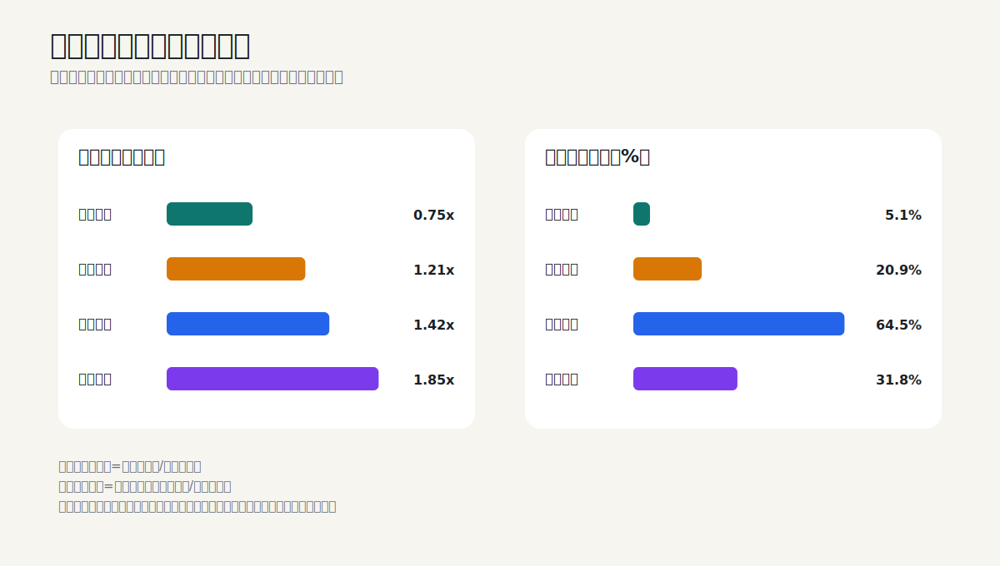

# 横向比较：同一个指标，在五家公司里为什么含义不同

## 1. 先看总表，但不要停在总表

| 公司 | 2025收入增速 | 归母净利润增速 | 经营现金流增速 | 2025 ROE | 主要矛盾 |
|---|---:|---:|---:|---:|---|
| 贵州茅台 | -1.2% | -4.5% | -33.5% | 32.53% | 渠道、产品结构、财务公司现金扰动 |
| 美的集团 | +12.1% | +14.0% | -11.8% | 19.70% | 增长与营运资金、并购和资本投入 |
| 中国神华 | -13.2% | -5.3% | -17.6% | 12.76% | 周期量价、正常化利润和重资产再投资 |
| 招商银行 | +0.01% | +1.2% | 不适用 | 13.44% | 净息差、资产质量、拨备和资本约束 |
| 宁德时代 | +17.0% | +42.3% | +37.4% | 24.91% | 增长、存货、扩产、减值和质保责任 |

这张表只能定位问题，不能直接给公司排序。例如：

- 茅台现金转化率低，主要受财务公司影响，不能直接与宁德时代比较；
- 神华资本开支强度高，是矿山、电厂和运输资产决定的商业模式；
- 招商银行经营现金流没有制造业自由现金流含义；
- 宁德时代现金转化强，但存货和质保负债也在扩大。



## 2. 五种商业模式，五套优先指标

| 商业模式 | 第一优先指标 | 第二优先指标 | 最容易误用的指标 |
|---|---|---|---|
| 品牌消费品 | 量价、渠道、毛利率、合同负债 | 存货结构、销售收现、费用率 | 单看库存周转天数 |
| 综合制造业 | 分部增长、毛利率、营运资金 | 自由现金流、商誉、资本配置 | 单看集团收入增速 |
| 资源周期股 | 产量、售价、单位成本 | 正常化利润、资本开支、分红覆盖 | 单年PE |
| 银行 | 净息差、资产质量、拨备 | 存款结构、资本充足率、ROE | 经营现金流和普通资产负债率 |
| 成长制造业 | 出货、单位盈利、研发 | 产能利用率、存货、质保、自由现金流 | 单看利润增速或研发金额 |

## 3. 把“利润质量”拆成三个不同问题

### 3.1 会计真实性

问题是收入、成本、资产和负债是否按准则确认。主要证据来自：

- 审计意见与关键审计事项；
- 收入确认政策和截止测试；
- 应收函证、坏账和减值；
- 关联方和结构化主体；
- 会计估计变化。

### 3.2 现金含量

问题是利润是否变成现金。主要证据来自：

- 经营现金流与利润；
- 营运资金变化；
- 购建长期资产现金支出；
- 质保、税费和其他未来现金义务。

### 3.3 经济可持续性

问题是利润未来是否还能维持。主要证据来自：

- 品牌和渠道；
- 行业供需与竞争；
- 产能利用率和单位成本；
- 资产质量和资本约束；
- 管理层资本配置。

会计真实不等于经济可持续，现金很好也不等于估值便宜。

## 4. 四种现金流陷阱

### 茅台：金融子公司混入合并现金流

集团财务公司吸收成员单位存款和同业资金变化，会让经营现金流显著波动。应尽量分离酒类业务销售收现。

### 美的：理财赎回不等于主营自由现金

投资现金流转正可能来自收回金融投资，不应与经营现金流创造混为一谈。

### 神华：高经营现金仍需巨额长期投入

矿山、电厂、铁路和港口需要维持和扩张资本开支。现金转化率高，不代表全部现金可分红。

### 宁德时代：客户预付款和扩产同时发生

合同负债增长能增加经营现金，但对应未来交付义务；同时设备、库存和质保也占用资本。

## 5. 从2026年半年报开始建立自己的预测记录

### 披露前

每家公司只预测5-8个最重要变量，并写区间，不追求小数点精确。

示例：

```text
公司：
收入同比：
毛利率 / 净息差：
归母净利润同比：
经营现金流：
存货 / 不良率：
资本开支 / 核心一级资本：
最重要假设：
最大不确定性：
```

### 披露后

把偏差归为七类：

1. 销量或规模；
2. 价格或利差；
3. 产品或客户结构；
4. 单位成本；
5. 营运资金；
6. 资本开支和融资；
7. 会计估计或一次性项目。

不要只写“超预期”或“不及预期”，而要写清是哪一个驱动变量错了。

## 6. 一页投资备忘录

完成财报学习后，用以下结构形成投资判断：

```text
一、投资假设
公司通过____能力，在____行业中获得____回报。

二、证据
1.
2.
3.

三、正常化盈利
收入 / 资产规模：
正常利润率 / 净息差：
正常利润或自由现金流：

四、资产负债表
现金与债务：
营运资金 / 资产质量：
长期义务：

五、估值
悲观情景：
基准情景：
乐观情景：
当前价格隐含假设：

六、证伪条件
出现____时，必须重新评估或退出原判断。
```

“证伪条件”尤其重要。它把投资从故事变成可以更新的假设。

## 7. 综合练习

### 练习一：事实、推断还是问题

判断下列句子属于报表事实、分析推断还是待验证问题：

1. 茅台2025年直销收入占比约50.1%。
2. 茅台直销增长证明终端需求强劲。
3. 美的2025年商誉增长约15.8%。
4. 美的所有收购都创造了股东价值。
5. 神华2025年自产煤单位成本下降4.8%。
6. 当前煤价就是未来十年的正常煤价。
7. 招行不良率下降0.01个百分点。
8. 招行资产质量已经不存在风险。
9. 宁德时代发出商品增长较快。
10. 这些发出商品将在下一期全部变成高利润收入。

<details>
<summary>参考答案</summary>

- 事实：1、3、5、7、9；
- 推断且证据不足：2、4、6、8、10；
- 更合适的做法是把后五项改写成待验证问题。

</details>

### 练习二：选对指标

为每家公司选出最重要的三个2026年半年报指标：

- 贵州茅台：产品推算吨价、渠道收入与毛利率、合同负债；
- 美的集团：分部毛利率、营运资金、自由现金流；
- 中国神华：煤炭量价成本、资本开支、扣非利润；
- 招商银行：净息差、资产质量、核心一级资本；
- 宁德时代：产品收入与毛利率、存货与减值、质保与资本开支。

### 练习三：写出证伪条件

示例不是结论，而是写法：

- 如果茅台核心酒量价和渠道库存连续恶化，品牌稳定假设需要重估；
- 如果美的ToB增长长期不能提高ROIC，并购协同假设需要重估；
- 如果神华在中性煤价下自由现金无法覆盖分红，股息可持续性假设需要重估；
- 如果招行关注类和逾期贷款持续上升而拨备继续下降，资产质量假设需要重估；
- 如果宁德时代存货和固定资产继续快于收入增长且减值上升，扩产回报假设需要重估。

## 8. 学习完成标准

你不需要背下所有会计科目。达到以下标准，就已经能把财报用于投资：

- 能用三句话说明公司怎么赚钱；
- 能把收入变化拆成2-4个经营变量；
- 能找到利润表与现金流、资产负债表不一致之处；
- 知道行业核心指标及其边界；
- 能估计正常化利润或自由现金流；
- 能写出三个下一期验证指标和一个证伪条件；
- 最后才讨论估值和买入价格。
