# 投资策略与流派梳理

> 首次整理：2026 年 7 月 30 日；小白科普扩充：2026 年 7 月 31 日；术语文档拆分：2026 年 8 月 4 日。本文用于建立投资方法框架，不构成个性化投资建议或收益承诺。实际投资前应结合资金期限、风险承受能力、税费、交易成本和产品合同条款独立判断。

## 一句话总览

投资策略本质上是在回答一个问题：**你想赚哪一种钱**。

不同流派并不是互相排斥的答案，而是对收益来源、风险来源和执行方式的不同选择。普通投资者通常更适合用“宽基指数或资产配置做核心，少量风格、行业、主题或交易策略做卫星”的方式组合使用。

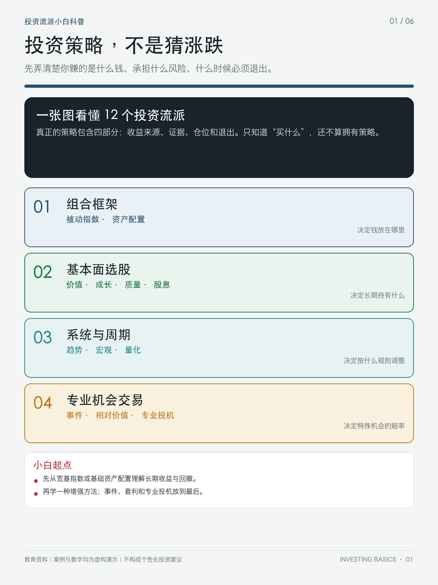

## 第一部分：10 分钟小白入门

### 这份文档应该怎么读

- 只想先建立常识：读完“四层方法地图、投资前七条底线、风险预算”即可。
- 遇到 PE、ROE、自由现金流等陌生概念：打开[《投资小白术语与估值入门》](beginner_investing_glossary.md)。
- 想选一个起步方法：继续阅读“新手选择路线”和“流派适配矩阵”。
- 已经开始投资：重点使用“完整决策案例、买入前检查清单、交易计划模板”。
- 需要深入研究：再进入每个流派的指标表、流程图和详细信息图。

不要一开始就试图掌握所有流派。对多数零基础读者，更稳妥的学习顺序是：

```text
理解风险和产品
→ 学习宽基指数与基础资产配置
→ 再选择价值、质量、成长或股息作为增强
→ 最后才研究趋势、宏观、量化、事件、套利和专业投机
```

### 先建立一张投资方法地图

现有 12 个流派并不处在同一个层级。下面的四层分类是为了教学方便，回答的是四个不同问题：

| 层级 | 它主要回答什么 | 包含的流派 | 小白需要先理解什么 |
|---|---|---|---|
| 组合框架 | 钱应该放在哪些资产里 | 被动指数、资产配置 | 投资期限、股债比例、现金需求、再平衡 |
| 基本面选股 | 什么资产或公司值得长期持有 | 价值、成长、质量/护城河、股息/现金流 | 估值、盈利、现金流、竞争优势 |
| 系统与周期策略 | 什么时候、按什么规则提高或降低暴露 | 趋势/动量、宏观/周期、量化/因子 | 信号、周期、模型、交易成本 |
| 专业机会交易 | 某个事件或价差是否存在明确赔率 | 事件驱动、套利/相对价值、专业投机 | 失败损失、流动性、杠杆、严格退出 |

四层之间可以组合，但不能随意拼接同一笔交易的规则。例如，可以用资产配置决定“股票只占组合的一部分”，再用质量方法选择公司；但不能以价值投资为理由买入，亏损后临时改口说自己在做长期趋势。

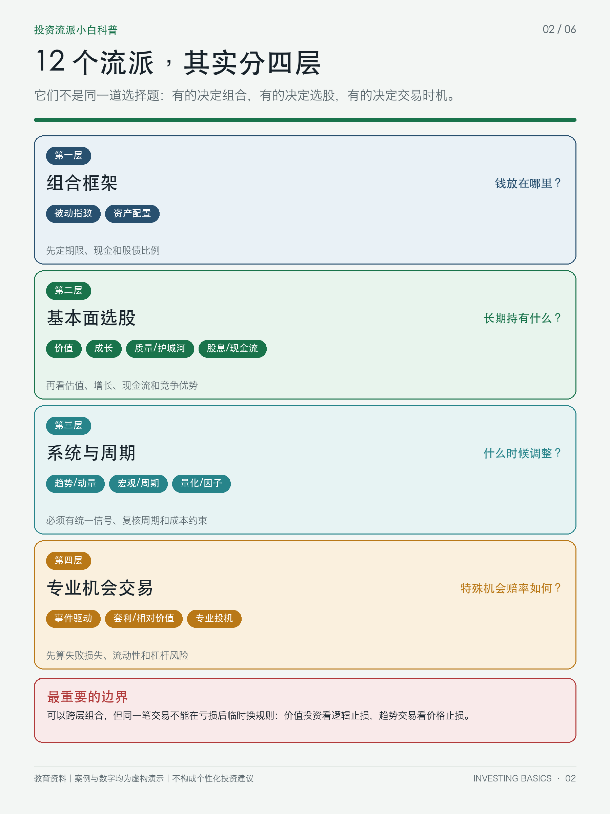

### 新手先回答五个问题

1. **这笔钱什么时候要用？** 短期内有明确用途的钱，不适合承担可能长期无法恢复的波动。
2. **最多能接受多大账面回撤？** 不要只问“想赚多少”，先问跌多少仍能正常生活和执行计划。
3. **每周能投入多少研究时间？** 没时间看财报、公告和价格信号，就不要选择依赖持续跟踪的方法。
4. **更相信什么证据？** 可以是分散与长期增长、公司基本面、价格趋势、宏观数据或事件条款。
5. **能否严格执行退出规则？** 做不到价格止损，就不适合高频或杠杆交易；做不到长期跟踪，也不适合集中持有个股。

一个简化的选择路线：

- 没时间研究、目标是长期积累：先学被动指数和资产配置。
- 愿意读财报、持有数年：再学价值、质量、成长或股息。
- 能按固定规则执行并接受连续小亏：可在模拟记录后学习趋势或简单因子。
- 能深度跟踪政策、模型、交易条款和流动性：再研究宏观、量化、事件和套利。
- 想做短线但没有交易系统、风险预算和复盘记录：先不实盘做专业投机。

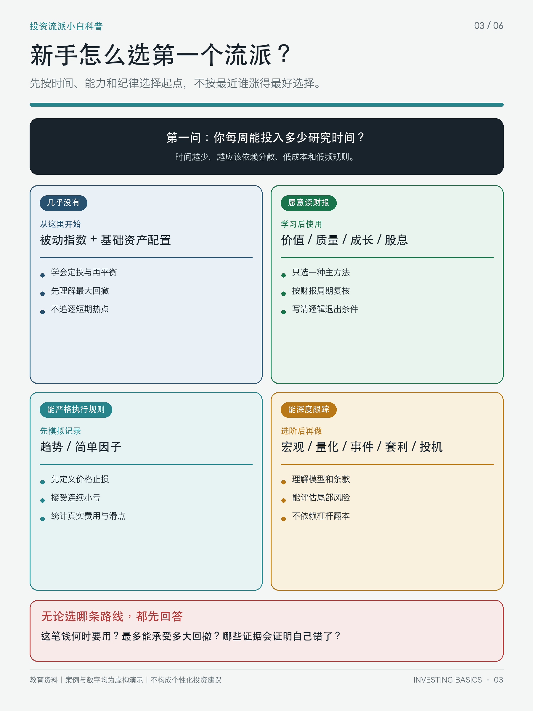

### 投资前必须知道的七条底线

1. **收益越高，通常意味着承担的风险、波动或不确定性越高。**
2. **短期要用的钱和应急资金，不应依赖高波动资产在指定时间上涨。**
3. **看不懂收益来自哪里、最坏会亏什么，就还没有达到买入条件。**
4. **先确定最大可承受损失，再计算仓位，而不是买完以后才想止损。**
5. **分散不是买很多名字，而是避免收益都依赖同一个风险来源。**
6. **费用、税费、滑点、流动性和融资成本都会侵蚀纸面收益。**
7. **同一笔交易只能使用一套主要逻辑，不能在亏损后临时更换流派。**

### 风险预算：先算能亏多少，再算买多少

以下数字只用于演示计算方法，不是适合所有人的建议值。

#### 回撤为什么比想象中更难恢复

| 账户回撤 | 从剩余资金回到原点所需涨幅 |
|---:|---:|
| -10% | +11.1% |
| -20% | +25.0% |
| -30% | +42.9% |
| -40% | +66.7% |
| -50% | +100.0% |

计算公式：

```text
回本所需涨幅 = 1 ÷（1 - 回撤比例）- 1
```

这也是为什么仓位控制通常比“猜对下一次涨跌”更重要。

#### 交易型仓位的演示计算

假设：

- 账户资金为 100,000 元。
- 这笔交易最多允许亏损 500 元，即账户的 0.5%。
- 入场价到止损价的距离为 5%。

则理论仓位上限为：

```text
仓位金额 = 允许亏损金额 ÷ 止损比例
         = 500 ÷ 5%
         = 10,000 元
```

这只是理论值。跳空、滑点、交易费用、流动性不足和无法及时成交，都可能让实际亏损超过预算。对于没有明确价格止损的长期投资，应通过更低的初始仓位、持仓上限、分散和逻辑退出条件管理风险，不能生搬硬套上述公式。

#### 三种退出机制不要混用

| 退出机制 | 主要适用 | 触发依据 | 典型例子 |
|---|---|---|---|
| 逻辑止损 | 价值、成长、质量、股息 | 原投资假设被证伪 | 现金流恶化、增长逻辑失败、护城河消失 |
| 价格止损 | 趋势、技术交易 | 价格达到预设风险边界 | 跌破突破位、前低或 ATR 止损线 |
| 配置再平衡 | 指数、资产配置 | 实际权重偏离目标区间 | 股票上涨后超配，卖出部分恢复目标比例 |

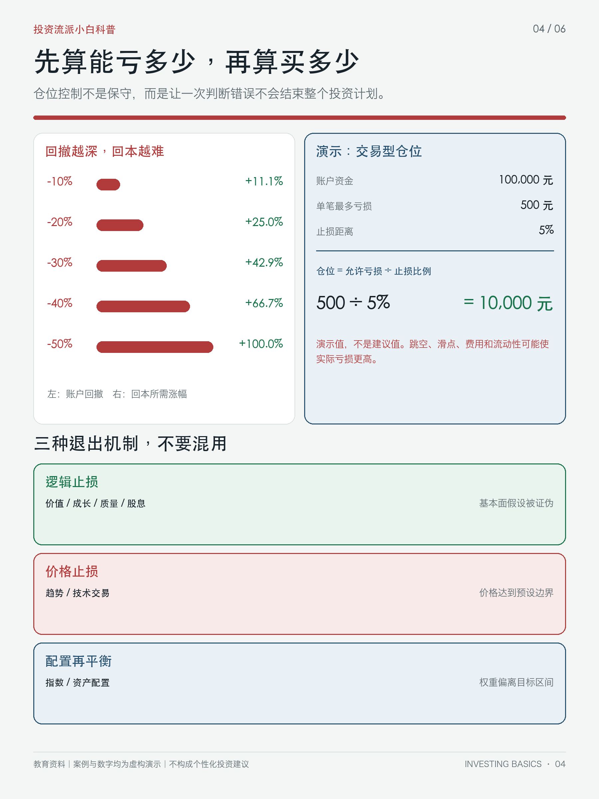

### 小白术语与估值入门

PE、PB、ROE、ROIC、经营现金流、自由现金流等基础概念，以及银行、消费、医药、软件、半导体等行业的 PE 实例，已经拆分到独立文档：

[阅读《投资小白术语与估值入门》](beginner_investing_glossary.md)

建议先学会“指标在算什么、为什么变化、什么时候失真”，再使用后文的流派指标和决策规则。独立文档也保留了“利润为什么没有变成现金”的完整案例。

### 哪些是流派，哪些只是执行方法

| 常见名称 | 更准确的定位 | 可以服务哪些流派 | 主要误区 |
|---|---|---|---|
| 定投 | 分批投入方式 | 指数、资产配置、部分长期基本面策略 | 定投不能修复产品质量差或逻辑失效 |
| 分批建仓 | 降低一次性择时影响的执行方式 | 几乎所有非高频策略 | 没有仓位上限会变成无限补仓 |
| 网格交易 | 围绕价格区间反复买卖的规则 | 震荡型或均值回归策略 | 单边下跌会不断接货，单边上涨会过早卖完 |
| 做 T | 日内或短周期降低成本的交易动作 | 已有持仓上的战术操作 | 增加交易成本，也可能卖飞或放大仓位 |
| 止盈止损 | 风险退出工具 | 所有流派，但触发依据不同 | 把固定百分比机械套到所有策略 |
| 行业轮动 | 在行业之间调整暴露 | 趋势、宏观、量化 | 追逐近期热点而没有统一信号 |
| 主题/赛道投资 | 研究对象或持仓方向 | 成长、趋势、宏观、量化 | 只有热门故事，没有估值、仓位和退出规则 |
| 逆向/均值回归 | 买入偏离并等待修复的子策略 | 价值、量化、相对价值 | 把结构性恶化误判为短期偏离 |
| GARP | 合理价格买成长 | 价值与成长的交叉分支 | 既高估增长，也高估合理价格 |
| Smart Beta | 按因子规则构建指数 | 指数与量化的交叉工具 | 名称“智能”不代表任何环境都有效 |
| 风险平价 | 按风险贡献而非资金比例配置 | 资产配置、量化 | 常依赖历史波动、相关性和杠杆假设 |
| ETF、基金、股票 | 承载策略的产品工具 | 可以承载多种流派 | 把“买了 ETF”误认为已经完成资产配置 |

## 第二部分：12 个主流投资策略

| 流派 | 想赚的钱 | 核心逻辑 | 典型工具 | 主要风险 |
|---|---|---|---|---|
| 被动指数派 | 市场长期上涨的钱 | 不预测个股和择时，持有宽基市场组合 | 宽基指数基金、ETF | 市场整体下跌、长期横盘、估值过高 |
| 资产配置派 | 大类资产风险溢价的钱 | 在股票、债券、现金、黄金、商品等资产间分散和再平衡 | 股债组合、全天候、目标日期基金 | 配置假设失效、相关性上升 |
| 价值投资派 | 低估修复的钱 | 买入价格低于内在价值的资产，等待市场重新定价 | 低 PE/PB、高股息、困境反转 | 价值陷阱、基本面继续恶化 |
| 成长投资派 | 企业高速增长的钱 | 为未来收入、利润和市场空间支付较高估值 | 科技成长、医药创新、消费成长 | 增长不达预期、估值压缩 |
| 质量/护城河派 | 优秀企业长期复利的钱 | 买竞争优势强、现金流好、管理层优秀的公司 | 高 ROE、强品牌、网络效应、成本优势公司 | 买得太贵、护城河被削弱 |
| 股息/现金流派 | 分红、利息和租金的钱 | 重视稳定现金回报和持有期收入 | 红利 ETF、债券、REITs、公用事业股 | 分红下降、利率上行、资产质量变差 |
| 趋势/动量派 | 趋势延续的钱 | 价格强势往往会持续一段时间，顺势而为 | 均线、突破、相对强弱、行业轮动 | 震荡市反复止损、追高回撤 |
| 宏观/周期派 | 经济和政策周期切换的钱 | 根据增长、通胀、利率、汇率和政策变化配置资产 | 股票、债券、商品、黄金、外汇 | 宏观判断对但节奏错 |
| 量化/因子派 | 统计规律和风格溢价的钱 | 用系统规则捕捉长期有效的因子 | 价值、动量、质量、低波动、小市值、Carry | 因子拥挤、交易成本、历史规律失效 |
| 事件驱动派 | 特殊事件重估的钱 | 围绕并购、重组、回购、分拆、指数纳入等事件定价 | 并购套利、重组股、定增、指数调整交易 | 事件失败、审批变化、时间拉长 |
| 套利/相对价值派 | 价差收敛的钱 | 买低估的一边，卖高估的一边，等待价差回归 | 可转债套利、ETF 折溢价、期现套利、配对交易 | 杠杆、流动性、制度变化 |
| 专业投机/技术交易派 | 价格波动和赔率的钱 | 不执着预测价值，重视趋势、止损、仓位和风险回报 | 1-2-3 反转、2B 假突破、波段交易、趋势跟随 | 纪律失效、过度交易、连续亏损 |

### 流派适配矩阵

以下持有期和复核频率是典型情况，不是固定规则。同一流派内部也可能存在不同周期。

| 流派 | 学习难度 | 典型持有期 | 复核频率 | 常用工具 | 相对顺风环境 | 相对困难环境 | 新手适配 |
|---|---|---|---|---|---|---|---|
| 被动指数 | 低 | 5 年以上 | 月度投入、年度复核 | 宽基 ETF、指数基金 | 企业盈利长期增长、估值合理 | 市场整体高估、长期横盘 | 适合作为起点 |
| 资产配置 | 低至中 | 3 年以上 | 季度或阈值再平衡 | 股票、债券、现金、黄金基金 | 资产表现分化、相关性较低 | 股债同跌、通胀或流动性冲击 | 适合作为核心 |
| 价值投资 | 中 | 1 至 5 年 | 财报期和重大事件 | 股票、价值 ETF | 悲观预期修复、周期见底 | 价值陷阱、产业永久衰退 | 学习财报后使用 |
| 成长投资 | 中至高 | 1 至 5 年 | 月度经营、季度财报 | 股票、成长 ETF | 渗透率提升、盈利上修 | 增速下台阶、估值收缩 | 小仓学习 |
| 质量/护城河 | 中 | 3 年以上 | 季度和年度 | 股票、质量因子 ETF | 稳定增长、资本回报持续 | 护城河削弱、买入估值过高 | 学习后适合 |
| 股息/现金流 | 中 | 3 年以上 | 财报和分红周期 | 红利 ETF、股票、债券、REITs | 现金流稳定、估值合理 | 分红削减、利率快速上升 | 辨别股息陷阱后使用 |
| 趋势/动量 | 中至高 | 数周至数月 | 每日或每周 | ETF、股票、期货 | 单边趋势清晰 | 区间震荡、假突破频繁 | 先模拟再实盘 |
| 宏观/周期 | 高 | 数月至数年 | 月度数据、政策事件 | 股债商品黄金、行业 ETF | 周期方向清晰、政策持续 | 数据反复、市场提前定价 | 不建议直接起步 |
| 量化/因子 | 高 | 月度至多年 | 按模型周期 | 因子 ETF、程序化组合 | 因子溢价持续、成本可控 | 因子拥挤、结构突变 | 简单因子可学习 |
| 事件驱动 | 高 | 数日至数月 | 事件进展实时跟踪 | 股票、债券、衍生品 | 条款清晰、审批顺利 | 事件失败、时间拉长 | 进阶策略 |
| 套利/相对价值 | 很高 | 数日至数月 | 高频或每日 | 多空组合、期现、转债 | 价差可交易且有收敛机制 | 流动性枯竭、规则变化 | 不建议直接起步 |
| 专业投机/技术交易 | 高 | 日内至数月 | 每笔交易持续跟踪 | 股票、ETF、期货等 | 趋势或反转结构清晰 | 震荡、情绪化执行 | 先建立系统和记录 |

## 第三部分：各流派专业速查

### 1. 被动指数派

被动指数派认为，多数投资者很难长期稳定战胜市场，因此应以低成本方式持有市场组合。它的关键不是“买哪个神奇指数”，而是长期持有、控制费用、分散风险，并在市场大幅波动时不轻易放弃计划。

常见做法：

- 买入宽基股票指数基金或 ETF。
- 使用股票、债券和现金的基础组合。
- 定期定额投入，减少一次性择时压力。
- 按年度或阈值再平衡。

适合人群：长期资金、没有时间研究个股、希望降低决策复杂度的投资者。

### 2. 资产配置派

资产配置派关注的不是单只股票，而是不同资产类别在不同环境下的表现差异。它认为长期收益和回撤很大程度上来自资产比例，而不是个别标的选择。

常见做法：

- 股票提供长期增长弹性。
- 债券提供利息和风险缓冲。
- 现金提供流动性和再投入能力。
- 黄金或商品对冲部分通胀、汇率或信用风险。
- 定期再平衡，把涨多的资产减一点，跌多但逻辑未变的资产补一点。

核心难点：资产之间的相关性并不是固定的，危机时可能一起下跌。

### 3. 价值投资派

价值投资派的核心是“以低于价值的价格买入”。低估可能来自市场悲观、行业周期低谷、短期坏消息或流动性折价。

常见分支：

- 深度价值：买极度便宜的资产，关注清算价值或资产重估。
- 低估修复：买估值明显低于历史或同业的公司。
- 困境反转：买暂时遇到困难但有修复可能的公司。
- 价值成长：在合理价格买入仍能增长的公司。

最大风险：低估可能不是误判，而是基本面真的变差。

### 4. 成长投资派

成长投资派重视未来收入、利润、用户规模、市场空间和商业模式扩张能力。它愿意为未来支付溢价。

常见场景：

- 新技术渗透率提升。
- 行业集中度提高。
- 产品从小众走向大众。
- 公司从单一产品扩展到平台生态。

关键问题：

- 增长是否真实可持续？
- 毛利率、现金流和竞争格局是否支持估值？
- 高增长是否已经被股价充分定价？

### 5. 质量/护城河派

质量派不只问“便不便宜”，更问“这是不是一门长期好生意”。它重视商业模式、竞争优势、资本回报率、现金流质量和管理层能力。

常见护城河：

- 品牌和心智。
- 网络效应。
- 成本优势。
- 规模优势。
- 渠道和客户粘性。
- 专利、牌照或监管壁垒。

主要风险：好公司如果买得太贵，也可能长期收益一般。

### 6. 股息/现金流派

股息派追求可见现金流，尤其适合重视稳定收入的资金。它不等同于简单追逐最高股息率，而是要看分红是否可持续。

重点指标：

- 分红率是否合理。
- 自由现金流是否覆盖分红。
- 负债和资本开支是否可控。
- 行业是否稳定。
- 历史分红是否连续。

主要风险：股息率高有时是股价大跌后的结果，背后可能是利润下滑或资产质量恶化。

### 7. 趋势/动量派

趋势派相信价格走势包含信息，强势资产可能继续强势，弱势资产可能继续弱势。它更关注“市场正在做什么”，而不是“我认为它应该怎样”。

常见方法：

- 均线趋势。
- 突破交易。
- 相对强弱排序。
- 行业轮动。
- 中长期趋势跟随。

执行关键：

- 明确入场信号。
- 明确止损规则。
- 避免在震荡市频繁交易。
- 接受小亏损，用少数大趋势覆盖多次试错。

### 8. 宏观/周期派

宏观派从经济增长、通胀、利率、汇率、信用周期和政策方向出发，判断哪些资产更占优。

常见思路：

- 复苏期：股票和顺周期资产可能更强。
- 过热期：商品和资源品可能更受益。
- 滞胀期：现金流、防御资产、部分商品可能更重要。
- 衰退期：高等级债券和防御资产可能更有吸引力。

核心难点：宏观判断即使方向正确，资产价格也可能提前反映，导致入场节奏很难。

### 9. 量化/因子派

量化因子派把投资规则系统化，用数据筛选和组合构建来捕捉风格溢价。它强调可回测、可重复、可纪律化。

常见因子：

- 价值：便宜资产相对昂贵资产的超额收益。
- 动量：近期强势资产继续强势。
- 质量：盈利稳定、现金流好、财务稳健。
- 低波动：波动较低资产可能有更好的风险调整收益。
- 小市值：小公司长期可能存在规模溢价。
- Carry：持有高收益资产、融资低收益资产的利差收益。

主要风险：历史规律不一定持续，交易成本、拥挤交易和模型过拟合会削弱收益。

### 10. 事件驱动派

事件驱动派围绕明确事件进行投资，关注事件前后资产价格如何重新定价。

常见事件：

- 并购和私有化。
- 重组和资产注入。
- 回购和特别分红。
- 分拆上市。
- 指数纳入或剔除。
- 破产重整。
- 定增和股权激励。

主要风险：事件失败、审批延迟、条款变化和资金占用时间过长。

### 11. 套利/相对价值派

套利派不一定判断资产绝对涨跌，而是判断两个相关价格之间的偏离是否会收敛。

常见策略：

- ETF 折溢价套利。
- 期现套利。
- 可转债套利。
- 分级或衍生品结构套利。
- 配对交易。

需要特别注意：很多套利看似低风险，实际风险来自杠杆、流动性突然消失、交易规则变化和极端行情。

### 12. 专业投机/技术交易派

专业投机派强调市场行为、趋势、止损、仓位和赔率。它不把“预测正确”放在第一位，而是把“错了亏小、对了赚大”放在第一位。

核心原则：

- 先活下来，避免毁灭性亏损。
- 趋势比观点重要。
- 用证据确认反转，不凭感觉猜顶猜底。
- 每笔交易先定义止损，再考虑收益。
- 小亏可控，大赚放行。

常见技术框架：

- 1-2-3 反转：趋势线被破坏、不再创新高或新低、突破关键回调点。
- 2B 假突破：价格突破前高或前低后快速回到区间内，显示突破失败。
- 趋势跟随：顺着已经形成的趋势持有，直到趋势证伪。

## 第四部分：各流派指标与交易决策速查

建仓、加仓、止盈、止损不是所有流派都用同一套语言。长期投资类策略更重视“估值、基本面和配置比例是否还成立”，不宜把短期价格波动机械等同于止损信号；交易类策略则必须提前定义价格止损、仓位上限和单笔亏损上限。

通用原则：

- 建仓前先写清楚：买入理由、目标仓位、最大可承受亏损、退出条件。
- 加仓只能发生在证据变强或价格更有吸引力时，不能只是因为已经亏损。
- 止盈不是“赚了就卖”，而是当赔率下降、仓位超限、估值过高或趋势证伪时降低风险。
- 止损分两类：投资型止损看逻辑失效，交易型止损看价格触发。
- 不同流派可以组合使用，但同一笔交易的进出规则必须保持一致。

| 流派 | 重点关注指标 | 建仓决策 | 加仓决策 | 止盈决策 | 止损/退出决策 |
|---|---|---|---|---|---|
| 被动指数派 | 指数覆盖范围、估值分位、费用率、跟踪误差、基金规模、流动性、股债比例、最大回撤 | 选择低费率、跟踪稳定、流动性充足的宽基产品；用定投或分批方式降低择时压力 | 按固定周期定投；或在指数回撤、估值分位下降、目标资产权重低于计划时补回 | 不按短期盈利止盈；当权益仓位超过目标上限、估值极端偏高或资金期限缩短时再平衡 | 通常不做短线价格止损；退出条件是投资期限变化、风险承受能力下降、基金跟踪失真、费用或流动性明显恶化 |
| 资产配置派 | 目标权重、资产估值、债券收益率、通胀、利率、相关性、波动率、组合回撤、现金需求 | 先确定股票、债券、现金、黄金等目标比例，再按风险预算分批建仓 | 当某类资产低于目标权重，或估值和收益率明显改善时再平衡加仓 | 某类资产涨到明显超配、估值过高或组合风险超过预算时减仓 | 当人生阶段、资金期限或风险承受能力变化时重设配置；不是因为单一资产短跌就全盘退出 |
| 价值投资派 | PE/PB/EV/EBITDA、自由现金流收益率、资产负债率、ROE、分红、净现金、行业周期、折价幅度 | 估算保守内在价值，只有价格相对价值有足够安全边际时分批买入 | 基本面未恶化且价格进一步低估，或经营拐点被验证时加仓 | 价格接近或超过合理价值、折价修复完成、出现更高赔率机会时卖出或换仓 | 原估值假设被证伪、现金流恶化、债务风险上升、管理层失信、行业永久性衰退时退出 |
| 成长投资派 | 收入增速、利润增速、毛利率、留存率、用户增长、单位经济模型、市场空间、研发效率、估值/增长匹配 | 在增长确定性较高、商业模式可验证、估值没有透支过多时分批建仓 | 增长数据继续兑现、利润率改善、竞争优势增强、回调后估值更合理时加仓 | 增速下台阶、估值显著透支、渗透率接近天花板或仓位过度集中时减仓 | 增长逻辑失败、客户流失、毛利率结构性下滑、竞争格局恶化、现金消耗失控时退出 |
| 质量/护城河派 | ROE/ROIC、自由现金流、毛利率稳定性、品牌力、客户粘性、市场份额、负债率、管理层资本配置 | 优质公司进入合理价格区间时建仓，不强求最低估值 | 护城河增强、业绩质量稳定、短期波动导致估值回到合理区间时加仓 | 估值极端高、预期收益率明显下降、单一持仓超出组合上限时减仓 | 护城河被削弱、资本回报率长期下滑、现金流质量变差、治理问题或主业竞争力恶化时退出 |
| 股息/现金流派 | 股息率、分红率、自由现金流覆盖倍数、债务期限、利息覆盖倍数、资本开支、派息历史、监管政策 | 股息率相对历史和债券收益有吸引力，且分红由真实现金流支撑时建仓 | 股价回落使现金回报更高，同时分红覆盖和资产质量未恶化时加仓 | 股息率被价格上涨压低、分红增长停滞、利率环境变化或仓位超配时减仓 | 分红被削减、自由现金流无法覆盖分红、负债再融资压力上升、主业现金流恶化时退出 |
| 趋势/动量派 | 均线斜率、价格新高/新低、相对强弱、成交量、波动率、行业强弱、回撤深度 | 价格突破关键区间、站上趋势均线、相对强度排名靠前时试仓 | 突破后回踩不破、趋势延续、波动率可控时金字塔加仓 | 趋势加速过热、相对强度下降、跌破短期趋势线或达到预设风险回报目标时分批止盈 | 跌破关键均线、前低、突破位或 ATR 止损线时执行；单笔亏损必须提前限定 |
| 宏观/周期派 | PMI、CPI/PPI、利率、收益率曲线、信用利差、汇率、财政政策、货币政策、库存周期、企业盈利周期 | 宏观阶段与资产表现逻辑匹配，且价格尚未充分反映时建仓 | 数据连续验证同一方向、政策继续支持、资产价格仍有赔率时加仓 | 周期进入下一阶段、政策边际转向、资产拥挤或估值已充分反映时减仓 | 核心宏观假设反向变化，或市场走势与宏观判断长期背离且损失超过风险预算时退出 |
| 量化/因子派 | 因子暴露、历史胜率、信息比率、最大回撤、换手率、交易成本、容量、行业和风格偏离 | 因子有经济解释、回测不过拟合、交易成本可承受、组合分散后建仓 | 按模型再平衡；当因子暴露不足或组合偏离目标权重时机械调整 | 因子信号衰减、仓位达到上限、组合风险或行业偏离过大时减仓 | 模型失效、实盘回撤超过历史压力测试、交易成本上升、数据质量问题或因子拥挤时停用或降仓 |
| 事件驱动派 | 事件条款、审批概率、时间表、价差、失败损失、对手方信用、监管态度、资金占用成本 | 事件真实、条款清晰、预期收益覆盖失败损失和时间成本时建仓 | 审批进展、股东投票、监管反馈等证据提高成功率，且价差仍有吸引力时加仓 | 价差大幅收敛、事件临近落地、收益率不再覆盖风险时退出 | 事件失败、条款变差、审批延迟超预期、对手方信用恶化或市场价格暗示失败概率上升时退出 |
| 套利/相对价值派 | 折溢价、基差、利差、相关性、回归速度、融资成本、保证金、流动性、交易规则 | 价差偏离超过历史区间和交易成本，并有明确收敛机制时建仓 | 价差继续扩大但机制未变、保证金和流动性充足时有限加仓 | 价差回归到目标区间、资金效率下降或风险收益不再划算时平仓 | 收敛机制失效、相关性断裂、保证金压力上升、交易规则变化、流动性枯竭时止损 |
| 专业投机/技术交易派 | 趋势结构、支撑阻力、1-2-3 反转、2B 假突破、成交量、ATR、胜率、盈亏比、仓位风险 | 出现明确交易信号，且潜在收益至少覆盖预设风险倍数时小仓试错 | 只有浮盈保护后才加仓；沿趋势用回踩、突破或移动止损递进加仓 | 达到目标位、趋势衰竭、出现反向信号或赔率下降时分批兑现 | 入场理由失效、跌破止损位、单笔亏损达到风险上限时立即退出，不摊平亏损 |

## 第五部分：12 个流派的完整决策案例

> 以下标的、价格、比例和阈值全部为虚构演示，只用于说明每种方法如何形成决策闭环，不代表收益预测、推荐标的或通用参数。现实执行还需考虑税费、滑点、流动性、产品合同和个人风险承受能力。

### 案例 1：被动指数派

- **观察条件：** 小明有一笔长期不用的资金，希望分享整体企业盈利增长，不具备持续研究个股的时间。
- **建仓：** 选择覆盖面广、费率和跟踪误差较低、流动性充足的“宽基指数甲”，把计划权益资金分为六批投入。
- **加仓：** 每月投入新增资金；当权益权重低于计划区间时，用再平衡补回，而不是因为某一天大跌临时重仓。
- **减仓：** 权益上涨后超过目标上限，卖出超配部分并恢复股债比例。
- **退出：** 资金用途提前、风险承受能力下降，或基金跟踪质量和流动性明显恶化时调整。
- **最容易犯的错：** 上涨时追买、下跌时停投，把长期计划变成情绪择时。

### 案例 2：资产配置派

- **观察条件：** 小周既需要长期增长，也希望保留稳定性和未来支出的流动性。
- **建仓：** 演示组合设为股票 50%、债券 30%、黄金 10%、现金 10%，分批进入目标区间。
- **加仓：** 设定上下浮动 5 个百分点的演示再平衡带；某类资产跌到下限以下且配置逻辑未变时补回。
- **减仓：** 某类资产涨到上限以上时卖出超配部分，不预测它第二天是否见顶。
- **退出：** 家庭现金需求、收入稳定性或投资期限发生变化时，重设整个组合，而不是只处理表现最差的资产。
- **最容易犯的错：** 把再平衡理解为“越跌越买”，忽略相关性变化和资产本身的信用、久期或流动性风险。

### 案例 3：价值投资派

- **观察条件：** 研究者对“A 公司”的保守价值估计为每股 50 元，市场价因短期悲观降到 35 元，同时资产负债表仍稳健。
- **建仓：** 先买入目标仓位的三分之一，并写明价值估计依赖的盈利、资产质量和行业假设。
- **加仓：** 价格降到 30 元，但新财报显示现金流、债务和竞争地位没有恶化，且经营拐点开始出现，再增加一部分。
- **减仓：** 价格接近 48 至 52 元的合理区间，低估修复已基本完成，分批降低仓位。
- **退出：** 应收账款失控、债务条款恶化或核心资产价值被证伪，即使价格更便宜也退出。
- **最容易犯的错：** 只因为 PE 或 PB 很低就买入，把不断恶化的公司当成“更有安全边际”。

### 案例 4：成长投资派

- **观察条件：** “B 公司”所处市场渗透率仍低，收入保持较快增长，毛利率稳定，新增客户能够带来正向单位经济。
- **建仓：** 在估值没有透支未来多年增长的前提下小仓进入，并列出未来两个财报期要验证的收入、留存和现金消耗。
- **加仓：** 连续财报显示收入兑现、毛利率改善、客户留存稳定，股价回调后估值重新回到可接受区间时增加仓位。
- **减仓：** 市场已把多年乐观假设计入价格，或持仓在组合中过度集中时先降低风险。
- **退出：** 增长持续低于预期、获客成本恶化、毛利率结构性下降或融资需求失控时退出。
- **最容易犯的错：** 只跟踪收入增速，不看增长是否产生现金流，也不看估值已经反映了多少预期。

### 案例 5：质量/护城河派

- **观察条件：** “C 公司”多年保持较高 ROIC、稳定自由现金流和客户续约率，竞争对手难以复制其渠道和成本优势。
- **建仓：** 等价格进入能够提供合理长期预期收益率的区间后分批买入，不强求最低点。
- **加仓：** 市场份额继续提高、现金流质量稳定，短期非核心事件带来估值回落时增加仓位。
- **减仓：** 公司仍然优秀，但估值极端、预期回报明显下降或单一持仓超过组合上限时减仓。
- **退出：** 客户迁移、替代技术或管理层错误配置资本，使护城河和资本回报长期恶化时退出。
- **最容易犯的错：** 把“好公司”直接等同于“任何价格都是好投资”。

### 案例 6：股息/现金流派

- **观察条件：** “公用事业甲”分红率适中，自由现金流能够覆盖分红，债务期限分散，资本开支计划可控。
- **建仓：** 比较其股息率、债券收益率和历史区间，在现金回报具有吸引力且资产质量稳定时分批买入。
- **加仓：** 股价下跌提高股息率，但盈利、现金流覆盖和监管环境没有恶化时增加仓位。
- **减仓：** 价格上涨后现金回报相对债券明显失去吸引力，或该资产在组合中过度集中时减仓。
- **退出：** 分红被削减、自由现金流无法覆盖派息，或再融资压力威胁资产安全时退出。
- **最容易犯的错：** 看到两位数股息率就认为便宜，却没有检查市场是否正在提前定价分红削减。

### 案例 7：趋势/动量派

- **观察条件：** “行业 ETF 甲”突破持续数月的整理区间，相对强度进入前列，成交量和均线方向确认趋势。
- **建仓：** 演示入场价为 100 元，止损位为 94 元；先根据 6% 止损距离和允许亏损金额计算试仓，而不是直接满仓。
- **加仓：** 突破后回踩 100 元附近不破并重新走强，同时原仓位止损已上移、组合总风险仍在预算内时加仓。
- **减仓：** 趋势加速、波动异常扩大或相对强度持续下降时分批兑现并上移保护位。
- **退出：** 收盘有效跌破预设止损位或趋势结构被破坏时执行退出，不等待基本面新闻解释。
- **最容易犯的错：** 突破失败后取消止损，告诉自己标的“长期仍有价值”。

### 案例 8：宏观/周期派

- **观察条件：** 连续多期数据显示增长改善、库存下降、信用环境转松，研究者判断经济处于复苏早期。
- **建仓：** 选择对复苏更敏感但价格尚未充分反映的资产，用分批方式建立有限暴露。
- **加仓：** 后续数据、盈利预期和政策方向继续验证同一判断，且资产没有出现极端拥挤时增加仓位。
- **减仓：** 价格已大幅提前反映复苏，或通胀和政策开始改变下一阶段的风险收益时降低暴露。
- **退出：** 信用重新收紧、盈利预期反转，或市场持续走弱表明原阶段判断可能错误时退出。
- **最容易犯的错：** 宏观方向判断正确，却忽略资产价格已经提前上涨，以及数据发布本身具有滞后性。

### 案例 9：量化/因子派

- **观察条件：** 研究者建立一个有经济解释的质量加价值模型，并用未参与建模的数据检验交易成本、行业偏离和最大回撤。
- **建仓：** 按规则构建分散组合，限制单股、行业和因子暴露，不根据个人偏好临时删改模型结果。
- **加仓：** 在月度或季度再平衡时，按模型恢复目标权重，而不是因为某只股票下跌主观补仓。
- **减仓：** 因子暴露、行业集中或组合波动超过预设边界时按规则降低风险。
- **退出：** 数据质量异常、交易成本吞噬优势，或实盘回撤显著超出压力测试边界时暂停模型并复核。
- **最容易犯的错：** 反复修改参数直到历史曲线好看，产生过拟合，却没有真正的样本外检验。

### 案例 10：事件驱动派

- **观察条件：** “D 公司”收到每股 10 元的虚构收购要约，现价 9.20 元；若失败，估计价格可能回到 6 元。
- **建仓：** 先核实条款、融资、审批和时间表。忽略费用时，演示的盈亏平衡成功概率为 `(9.20 - 6) ÷ (10 - 6) = 80%`，只有研究概率明显高于该水平才考虑小仓。
- **加仓：** 股东投票、监管反馈或融资完成等新证据提高成功概率，而价差仍足以覆盖时间和失败风险时增加仓位。
- **减仓：** 价差大幅收敛，剩余收益不足以补偿尾部风险和资金占用时提前降低仓位。
- **退出：** 收购方信用恶化、审批受阻、条款变化或事件失败时执行退出。
- **最容易犯的错：** 只看成功时能赚 0.80 元，却忽略失败时可能亏 3.20 元以及资金占用时间。

### 案例 11：套利/相对价值派

- **观察条件：** 高度相关的“资产甲”和“资产乙”价差偏离历史区间，同时存在清晰、可交易的收敛机制。
- **建仓：** 买入相对便宜的一边、卖出相对昂贵的一边，并把融资成本、借券成本、保证金和滑点计入预期收益。
- **加仓：** 价差继续扩大但收敛机制未变、相关性仍稳定、保证金和流动性足够时，只在预设上限内增加。
- **减仓：** 价差回到目标区间，或剩余收益不足以覆盖持仓成本时分批平仓。
- **退出：** 相关性断裂、交易规则改变、借券被召回或流动性枯竭时止损，即使历史模型仍显示“应当回归”。
- **最容易犯的错：** 把历史上的高相关性当成结构性保证，并用杠杆等待价差无限期回归。

### 案例 12：专业投机/技术交易派

- **观察条件：** “资产丙”突破前高后快速跌回区间，形成 2B 假突破，随后跌破关键回调低点。
- **建仓：** 根据反转信号小仓入场，预先写明止损位、目标位、单笔允许亏损和最低盈亏比。
- **加仓：** 价格按预期运行、已有浮盈能够覆盖初始风险，并出现新的回抽失败信号时递进加仓，同时上移止损。
- **减仓：** 到达第一目标位、趋势加速衰竭或出现反向结构时分批兑现。
- **退出：** 价格重新站上使 2B 结构失效的位置，或单笔风险达到上限时立即退出。
- **最容易犯的错：** 亏损后向下摊平、取消止损，或用“再等等”替代已经写好的规则。

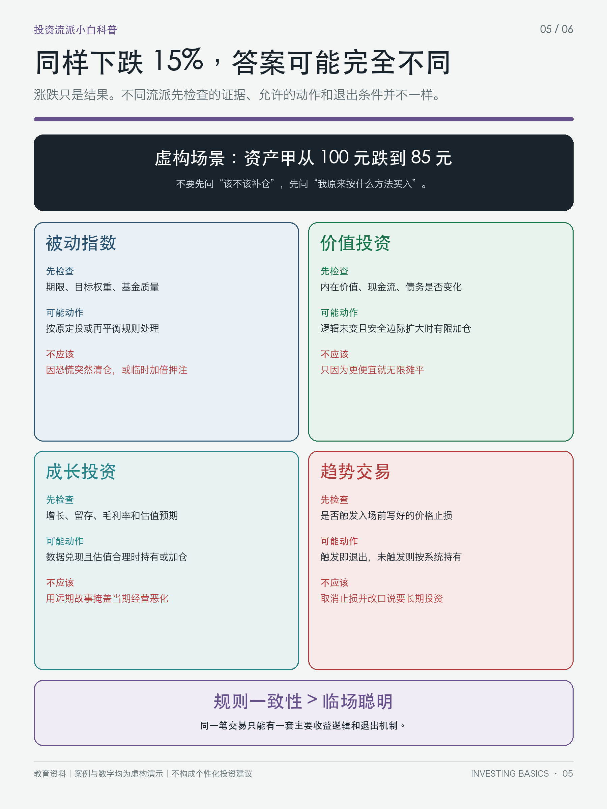

## 第六部分：把方法写成可执行计划

### 买入前五问

1. **我采用的主要流派是什么？** 如果说不清，就无法选择正确的指标和退出机制。
2. **这笔收益预计从哪里来？** 市场长期增长、低估修复、企业成长、现金流、趋势延续、周期变化、事件重估还是价差收敛？
3. **哪些证据支持买入？** 写出可以被后续数据验证或证伪的事实，不写“感觉会涨”。
4. **最坏情况是什么？** 包括价格下跌、逻辑失败、流动性消失、杠杆强平和资金提前使用。
5. **何时加仓、减仓和退出？** 必须在下单前写好，不能等情绪最强时临时决定。


### 一页投资计划模板

```text
标的或组合：
主要流派：
我想赚的钱：
预计持有期：

买入证据：
1.
2.
3.

初始仓位：
目标仓位上限：
允许亏损或最大风险暴露：

建仓方式：
加仓必须满足：
减仓或止盈条件：
逻辑止损 / 价格止损 / 再平衡条件：

需要持续跟踪的数据：
下次强制复核日期：
本计划最可能错在哪里：
```

### 复盘模板

```text
原计划采用的流派：
实际执行是否遵守原计划：
收益或亏损主要来自什么：
原判断哪些正确，哪些错误：
是否发生临时改规则、追涨、摊平或过度交易：
费用、滑点和资金占用是否超出预期：
这次结果是能力、运气，还是市场环境：
下一次只改哪一条可验证规则：
```

复盘的重点不是证明自己聪明，而是区分“过程正确但结果暂时亏损”和“结果赚钱但过程不可重复”。不要因为一次盈利就放松风险约束，也不要因为一次亏损就随意推翻经过检验的系统。

## 第七部分：专业决策流程图

以下图示用于描述每个流派的典型决策顺序。它们不是固定公式，真实执行时还需要结合产品费率、税费、交易成本、流动性和个人风险预算。

#### 被动指数派

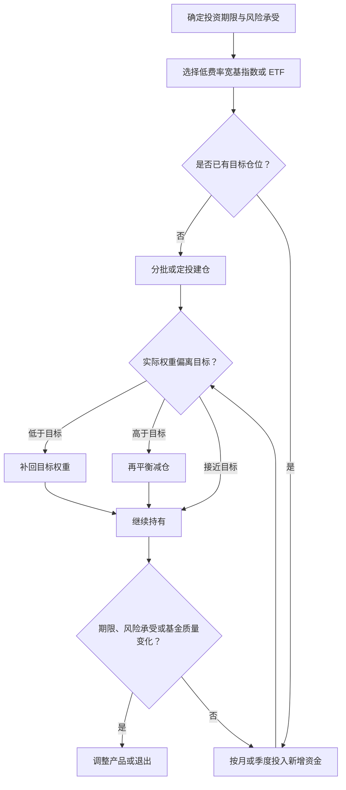
```mermaid
flowchart TD
  A["确定投资期限与风险承受"] --> B["选择低费率宽基指数或 ETF"]
  B --> C{"是否已有目标仓位？"}
  C -- "否" --> D["分批或定投建仓"]
  C -- "是" --> E["按月或季度投入新增资金"]
  D --> F{"实际权重偏离目标？"}
  E --> F
  F -- "低于目标" --> G["补回目标权重"]
  F -- "高于目标" --> H["再平衡减仓"]
  F -- "接近目标" --> I["继续持有"]
  G --> I
  H --> I
  I --> J{"期限、风险承受或基金质量变化？"}
  J -- "是" --> K["调整产品或退出"]
  J -- "否" --> E
```

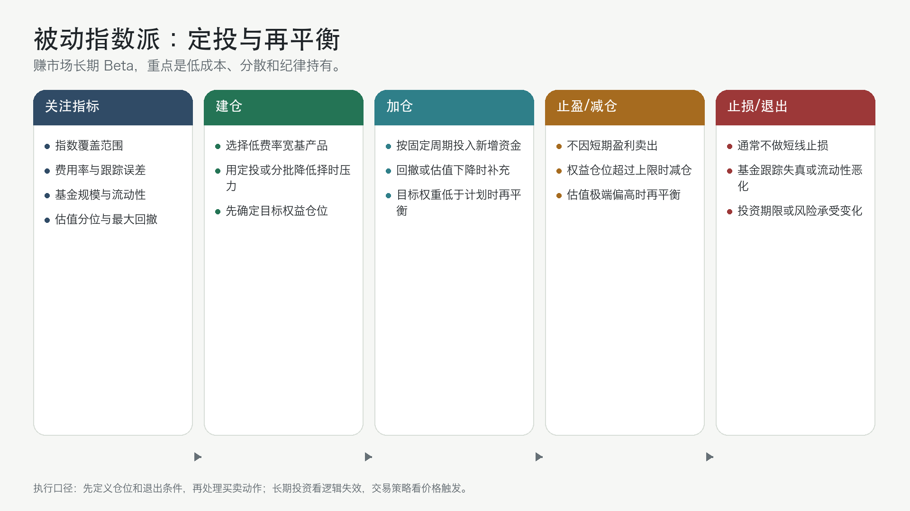

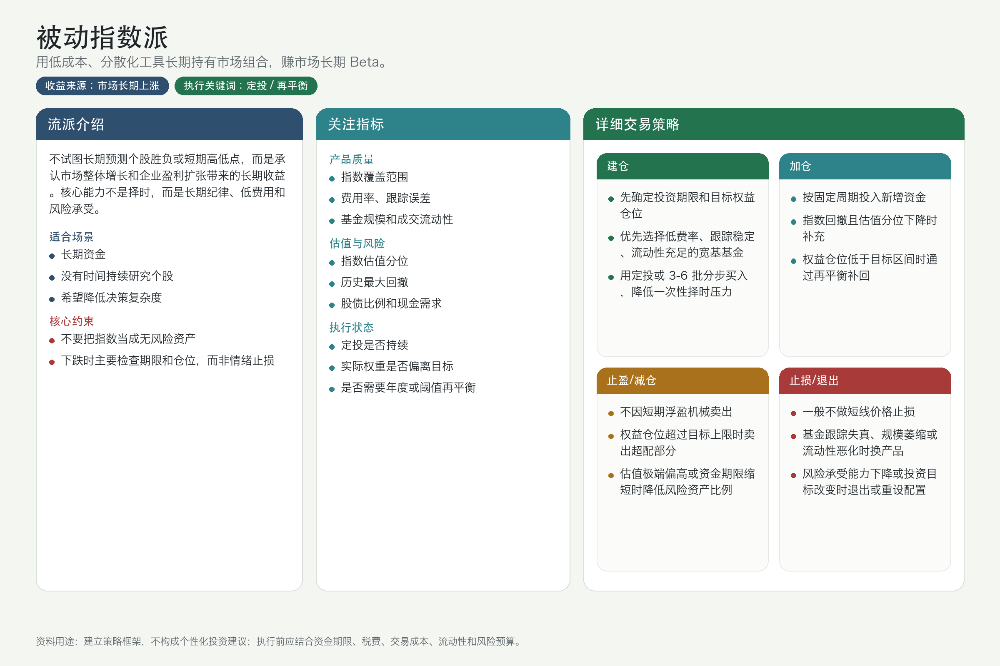

#### 资产配置派

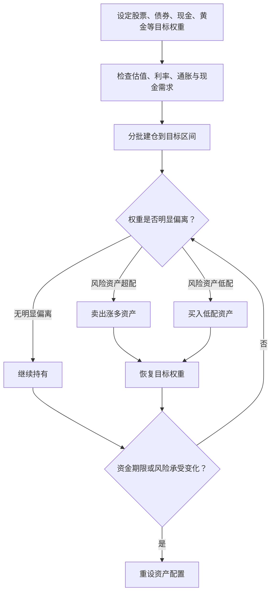
```mermaid
flowchart TD
  A["设定股票、债券、现金、黄金等目标权重"] --> B["检查估值、利率、通胀与现金需求"]
  B --> C["分批建仓到目标区间"]
  C --> D{"权重是否明显偏离？"}
  D -- "风险资产超配" --> E["卖出涨多资产"]
  D -- "风险资产低配" --> F["买入低配资产"]
  D -- "无明显偏离" --> G["继续持有"]
  E --> H["恢复目标权重"]
  F --> H
  G --> I{"资金期限或风险承受变化？"}
  H --> I
  I -- "是" --> J["重设资产配置"]
  I -- "否" --> D
```

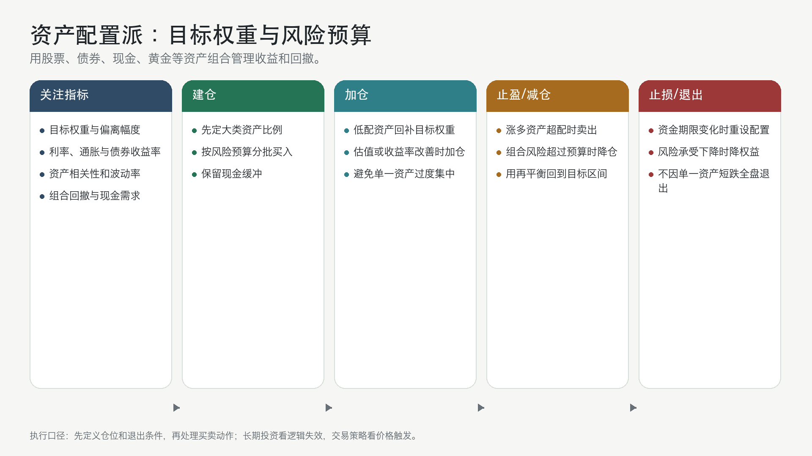

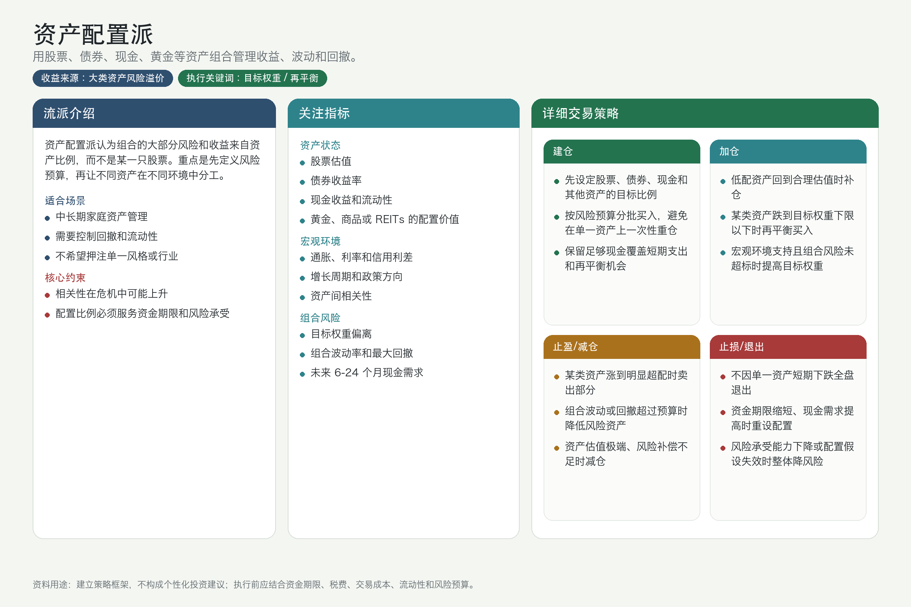

#### 价值投资派

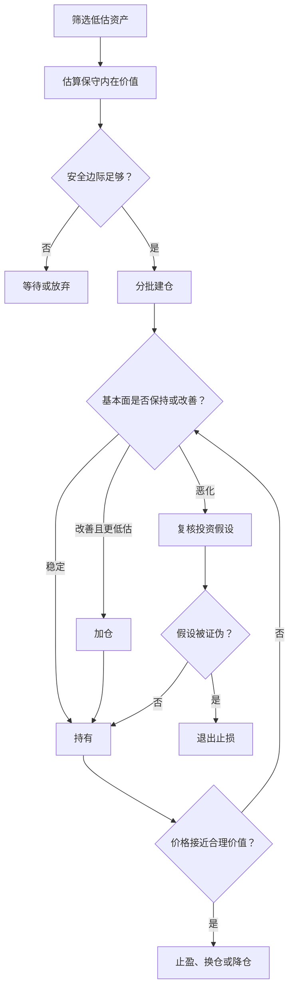
```mermaid
flowchart TD
  A["筛选低估资产"] --> B["估算保守内在价值"]
  B --> C{"安全边际足够？"}
  C -- "否" --> D["等待或放弃"]
  C -- "是" --> E["分批建仓"]
  E --> F{"基本面是否保持或改善？"}
  F -- "改善且更低估" --> G["加仓"]
  F -- "稳定" --> H["持有"]
  F -- "恶化" --> I["复核投资假设"]
  G --> H
  H --> J{"价格接近合理价值？"}
  J -- "是" --> K["止盈、换仓或降仓"]
  J -- "否" --> F
  I --> L{"假设被证伪？"}
  L -- "是" --> M["退出止损"]
  L -- "否" --> H
```

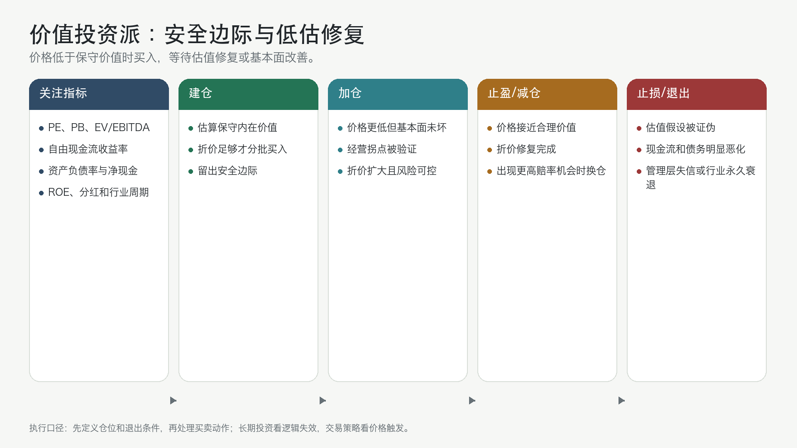

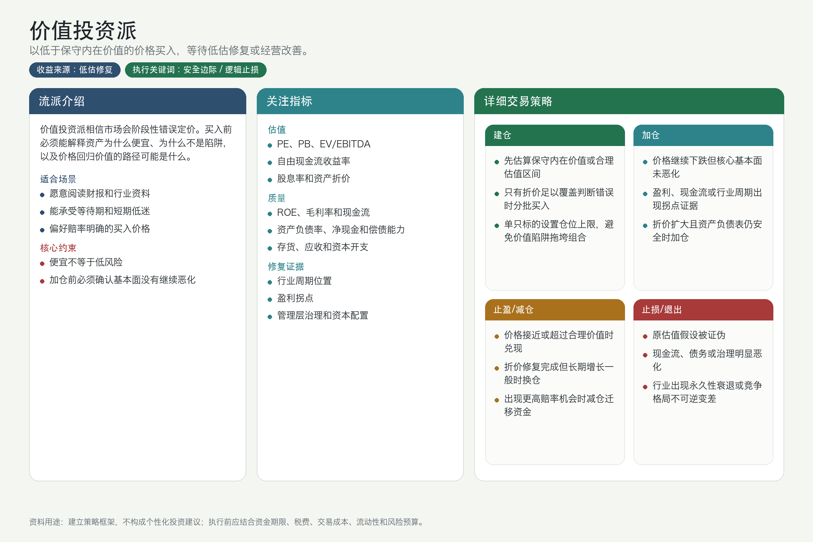

#### 成长投资派

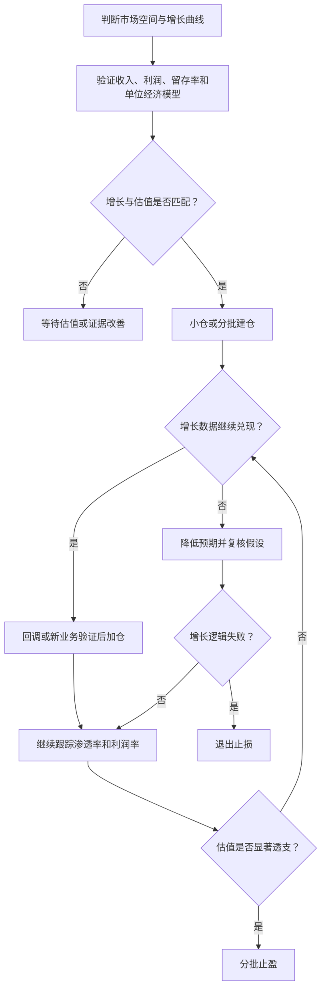
```mermaid
flowchart TD
  A["判断市场空间与增长曲线"] --> B["验证收入、利润、留存率和单位经济模型"]
  B --> C{"增长与估值是否匹配？"}
  C -- "否" --> D["等待估值或证据改善"]
  C -- "是" --> E["小仓或分批建仓"]
  E --> F{"增长数据继续兑现？"}
  F -- "是" --> G["回调或新业务验证后加仓"]
  F -- "否" --> H["降低预期并复核假设"]
  G --> I["继续跟踪渗透率和利润率"]
  I --> J{"估值是否显著透支？"}
  J -- "是" --> K["分批止盈"]
  J -- "否" --> F
  H --> L{"增长逻辑失败？"}
  L -- "是" --> M["退出止损"]
  L -- "否" --> I
```

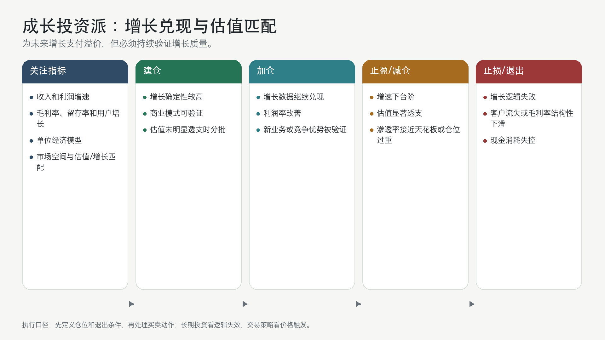

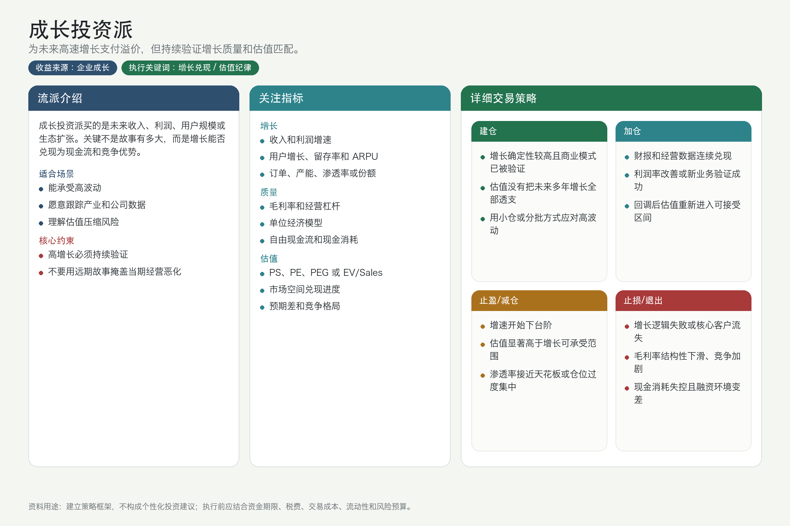

#### 质量/护城河派

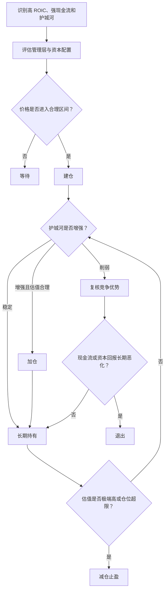
```mermaid
flowchart TD
  A["识别高 ROIC、强现金流和护城河"] --> B["评估管理层与资本配置"]
  B --> C{"价格是否进入合理区间？"}
  C -- "否" --> D["等待"]
  C -- "是" --> E["建仓"]
  E --> F{"护城河是否增强？"}
  F -- "增强且估值合理" --> G["加仓"]
  F -- "稳定" --> H["长期持有"]
  F -- "削弱" --> I["复核竞争优势"]
  G --> H
  H --> J{"估值是否极端高或仓位超限？"}
  J -- "是" --> K["减仓止盈"]
  J -- "否" --> F
  I --> L{"现金流或资本回报长期恶化？"}
  L -- "是" --> M["退出"]
  L -- "否" --> H
```

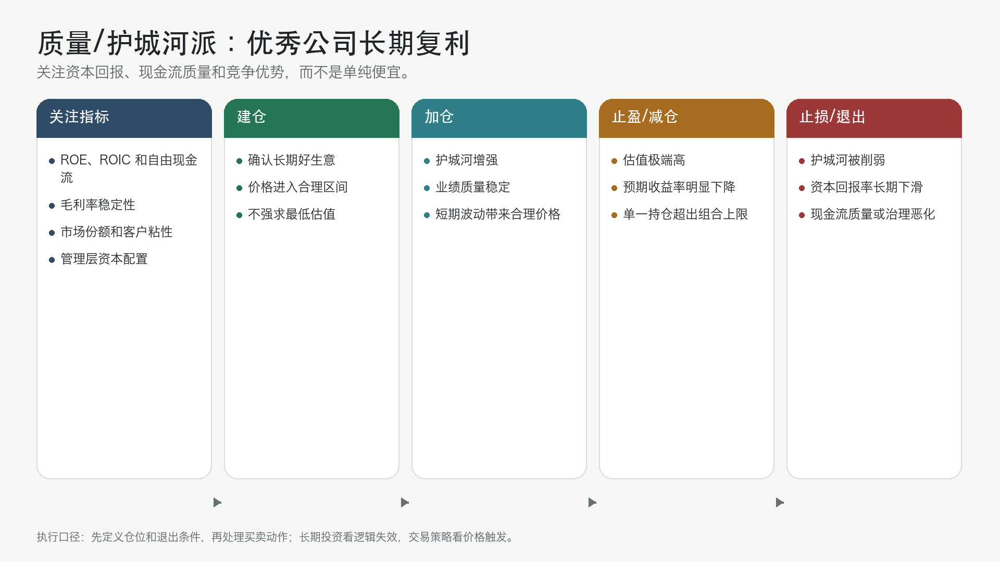

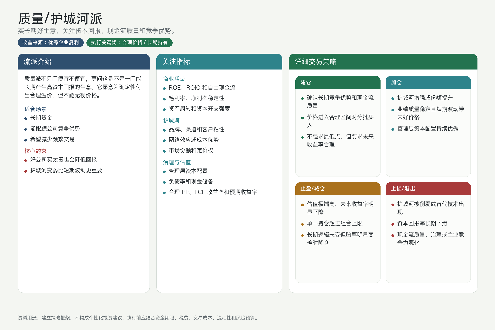

#### 股息/现金流派

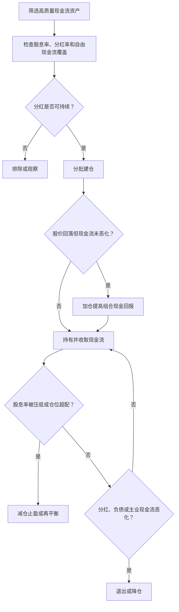
```mermaid
flowchart TD
  A["筛选高质量现金流资产"] --> B["检查股息率、分红率和自由现金流覆盖"]
  B --> C{"分红是否可持续？"}
  C -- "否" --> D["排除或观察"]
  C -- "是" --> E["分批建仓"]
  E --> F{"股价回落但现金流未恶化？"}
  F -- "是" --> G["加仓提高组合现金回报"]
  F -- "否" --> H["持有并收取现金流"]
  G --> H
  H --> I{"股息率被压低或仓位超配？"}
  I -- "是" --> J["减仓止盈或再平衡"]
  I -- "否" --> K{"分红、负债或主业现金流恶化？"}
  K -- "是" --> L["退出或降仓"]
  K -- "否" --> H
```

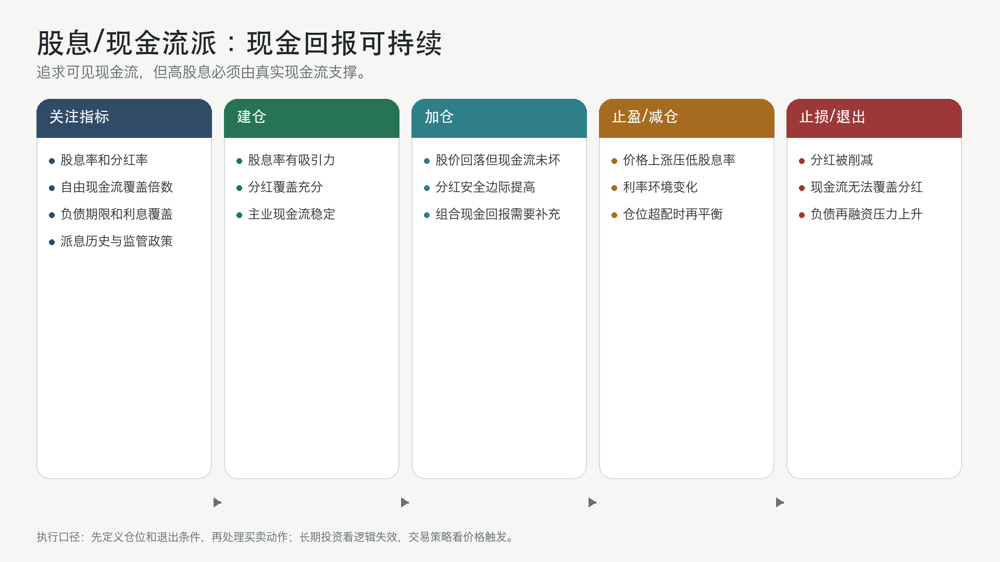

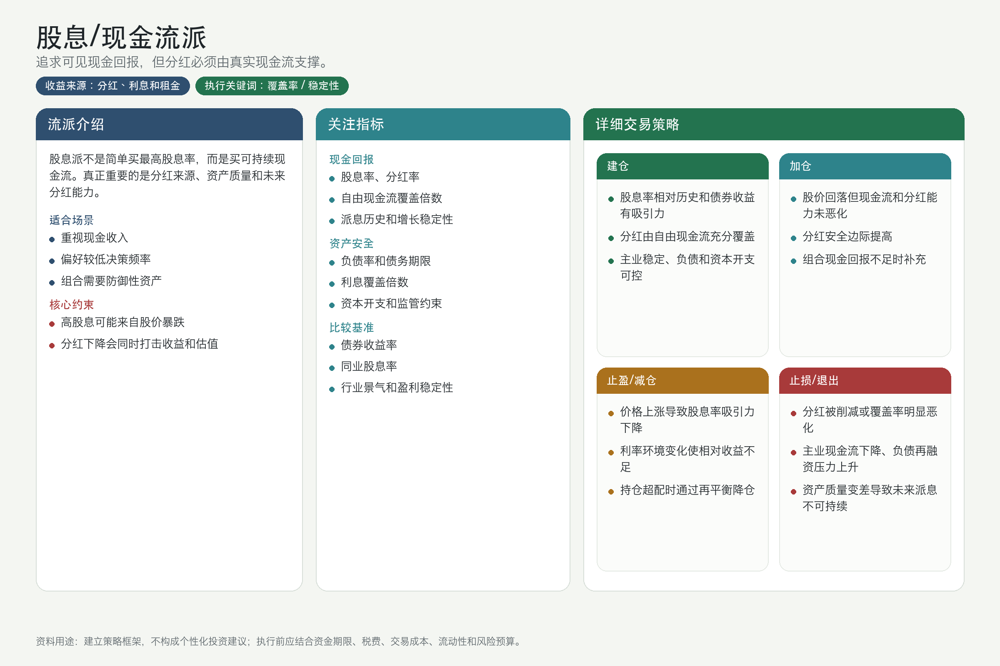

#### 趋势/动量派

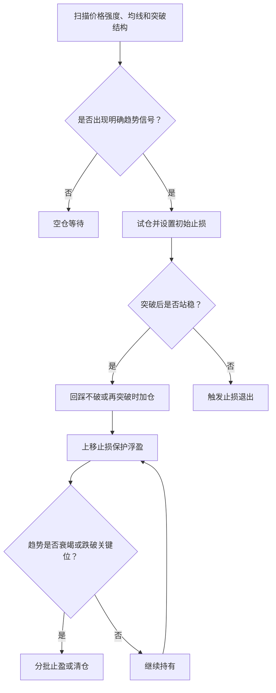
```mermaid
flowchart TD
  A["扫描价格强度、均线和突破结构"] --> B{"是否出现明确趋势信号？"}
  B -- "否" --> C["空仓等待"]
  B -- "是" --> D["试仓并设置初始止损"]
  D --> E{"突破后是否站稳？"}
  E -- "是" --> F["回踩不破或再突破时加仓"]
  E -- "否" --> G["触发止损退出"]
  F --> H["上移止损保护浮盈"]
  H --> I{"趋势是否衰竭或跌破关键位？"}
  I -- "是" --> J["分批止盈或清仓"]
  I -- "否" --> K["继续持有"]
  K --> H
```

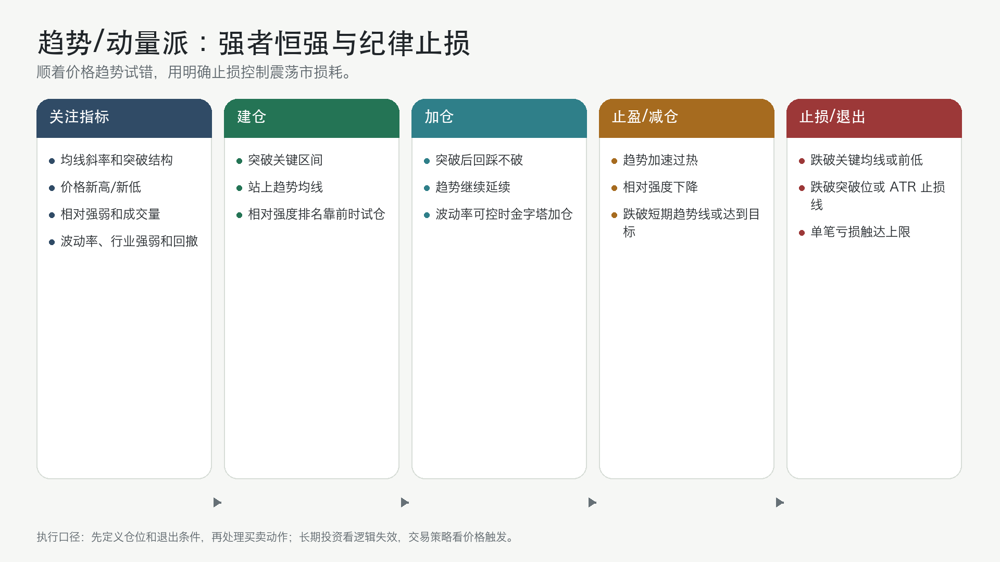

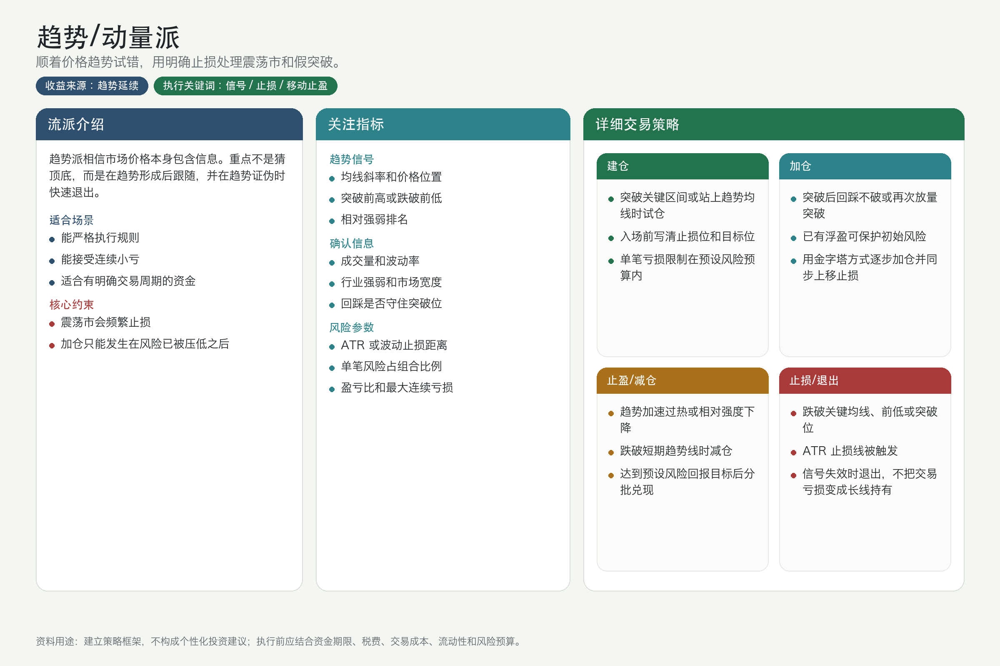

#### 宏观/周期派

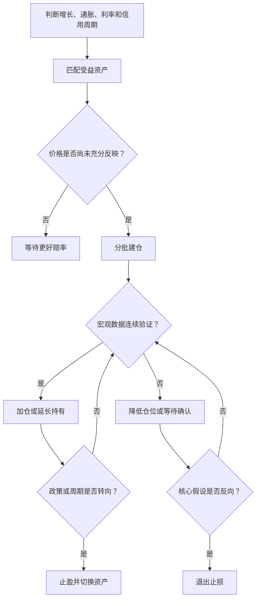
```mermaid
flowchart TD
  A["判断增长、通胀、利率和信用周期"] --> B["匹配受益资产"]
  B --> C{"价格是否尚未充分反映？"}
  C -- "否" --> D["等待更好赔率"]
  C -- "是" --> E["分批建仓"]
  E --> F{"宏观数据连续验证？"}
  F -- "是" --> G["加仓或延长持有"]
  F -- "否" --> H["降低仓位或等待确认"]
  G --> I{"政策或周期是否转向？"}
  I -- "是" --> J["止盈并切换资产"]
  I -- "否" --> F
  H --> K{"核心假设是否反向？"}
  K -- "是" --> L["退出止损"]
  K -- "否" --> F
```

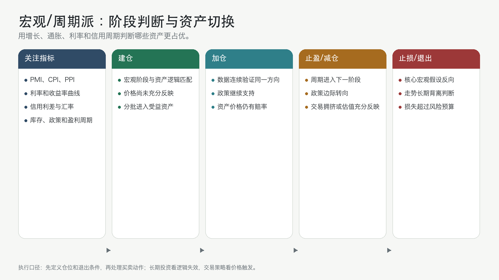

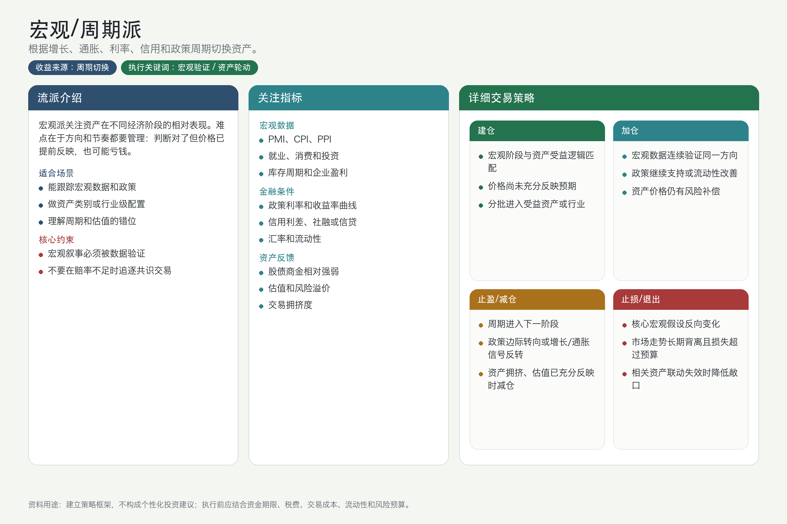

#### 量化/因子派

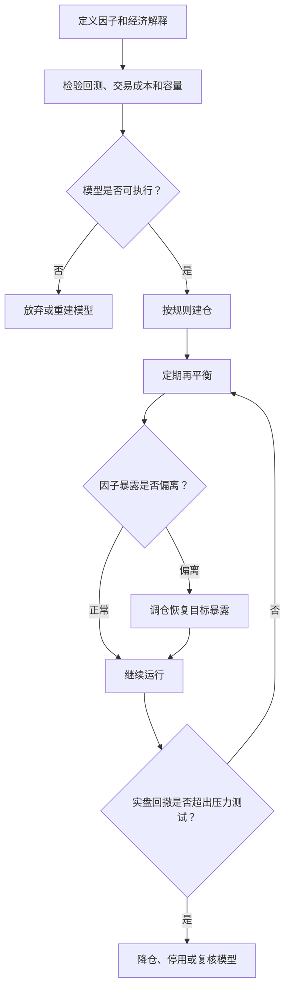
```mermaid
flowchart TD
  A["定义因子和经济解释"] --> B["检验回测、交易成本和容量"]
  B --> C{"模型是否可执行？"}
  C -- "否" --> D["放弃或重建模型"]
  C -- "是" --> E["按规则建仓"]
  E --> F["定期再平衡"]
  F --> G{"因子暴露是否偏离？"}
  G -- "偏离" --> H["调仓恢复目标暴露"]
  G -- "正常" --> I["继续运行"]
  H --> I
  I --> J{"实盘回撤是否超出压力测试？"}
  J -- "是" --> K["降仓、停用或复核模型"]
  J -- "否" --> F
```

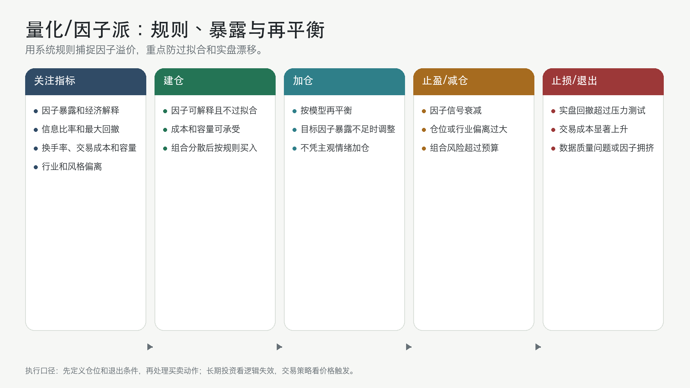

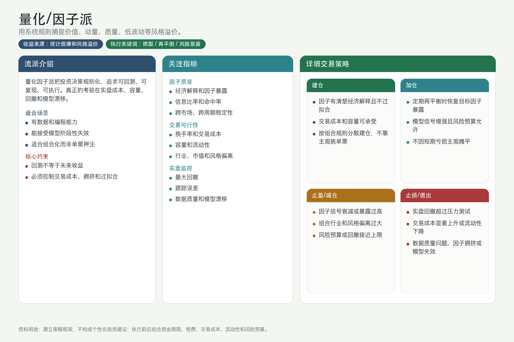

#### 事件驱动派

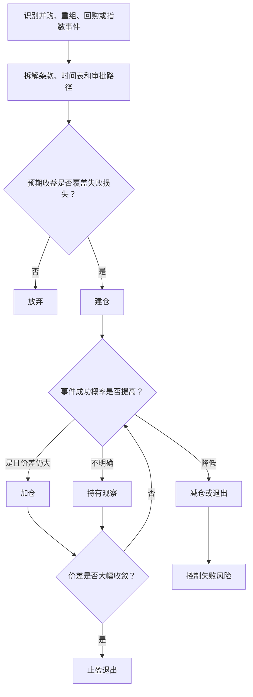
```mermaid
flowchart TD
  A["识别并购、重组、回购或指数事件"] --> B["拆解条款、时间表和审批路径"]
  B --> C{"预期收益是否覆盖失败损失？"}
  C -- "否" --> D["放弃"]
  C -- "是" --> E["建仓"]
  E --> F{"事件成功概率是否提高？"}
  F -- "是且价差仍大" --> G["加仓"]
  F -- "不明确" --> H["持有观察"]
  F -- "降低" --> I["减仓或退出"]
  G --> J{"价差是否大幅收敛？"}
  H --> J
  J -- "是" --> K["止盈退出"]
  J -- "否" --> F
  I --> L["控制失败风险"]
```

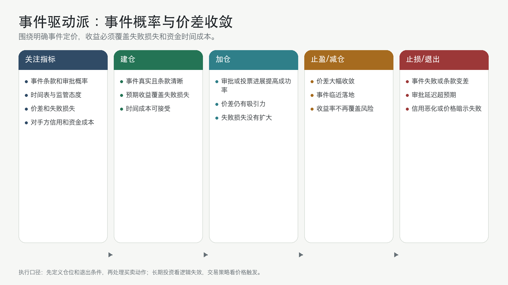

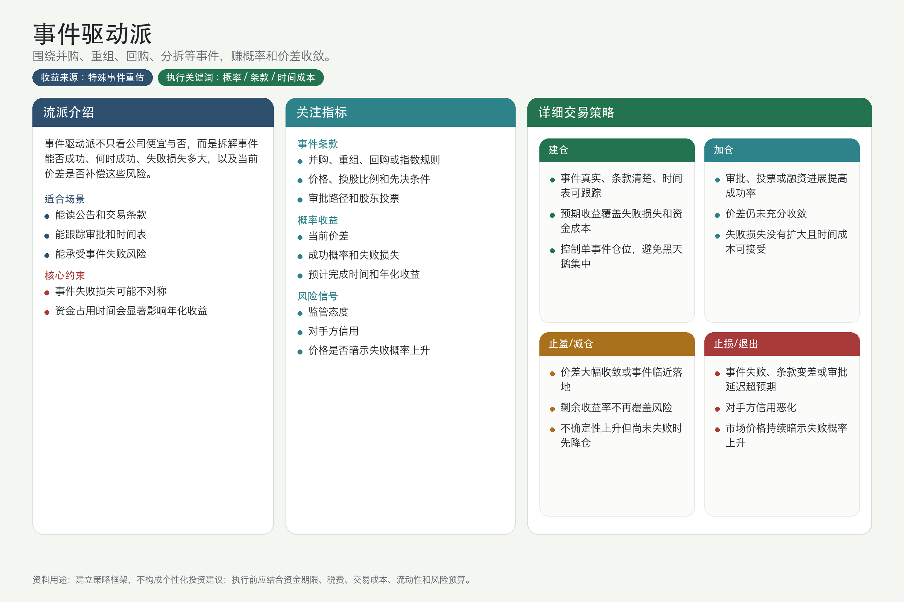

#### 套利/相对价值派

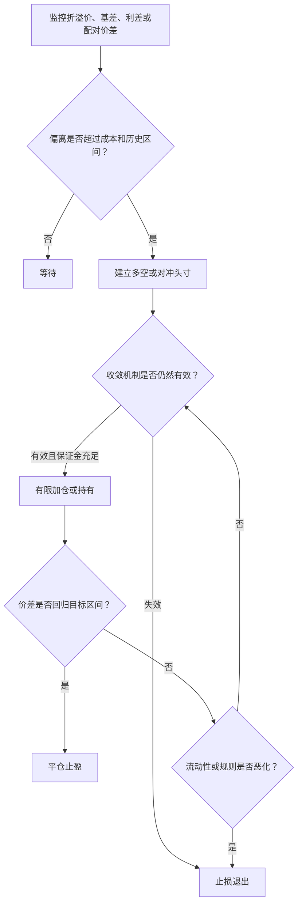
```mermaid
flowchart TD
  A["监控折溢价、基差、利差或配对价差"] --> B{"偏离是否超过成本和历史区间？"}
  B -- "否" --> C["等待"]
  B -- "是" --> D["建立多空或对冲头寸"]
  D --> E{"收敛机制是否仍然有效？"}
  E -- "有效且保证金充足" --> F["有限加仓或持有"]
  E -- "失效" --> G["止损退出"]
  F --> H{"价差是否回归目标区间？"}
  H -- "是" --> I["平仓止盈"]
  H -- "否" --> J{"流动性或规则是否恶化？"}
  J -- "是" --> G
  J -- "否" --> E
```

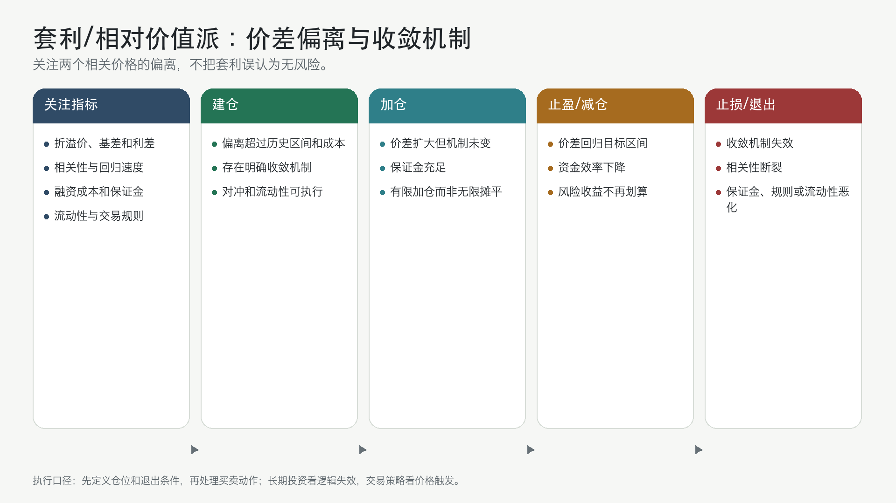

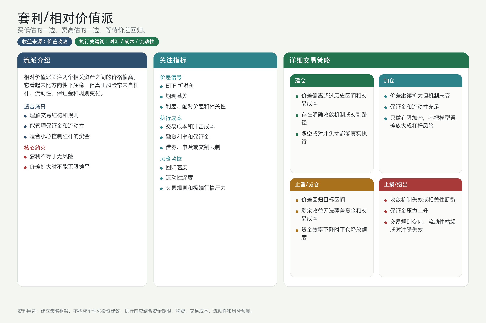

#### 专业投机/技术交易派

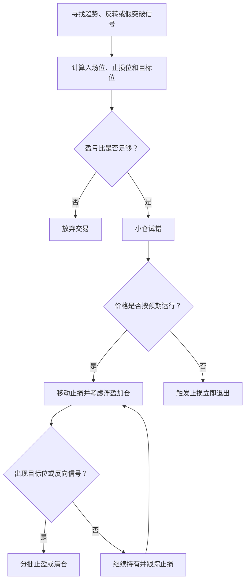
```mermaid
flowchart TD
  A["寻找趋势、反转或假突破信号"] --> B["计算入场位、止损位和目标位"]
  B --> C{"盈亏比是否足够？"}
  C -- "否" --> D["放弃交易"]
  C -- "是" --> E["小仓试错"]
  E --> F{"价格是否按预期运行？"}
  F -- "是" --> G["移动止损并考虑浮盈加仓"]
  F -- "否" --> H["触发止损立即退出"]
  G --> I{"出现目标位或反向信号？"}
  I -- "是" --> J["分批止盈或清仓"]
  I -- "否" --> K["继续持有并跟踪止损"]
  K --> G
```

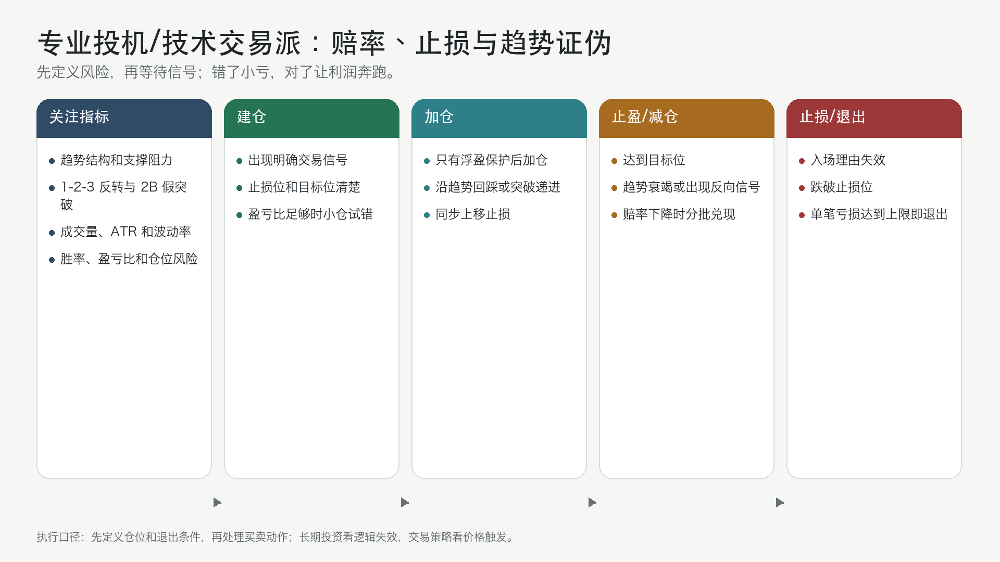

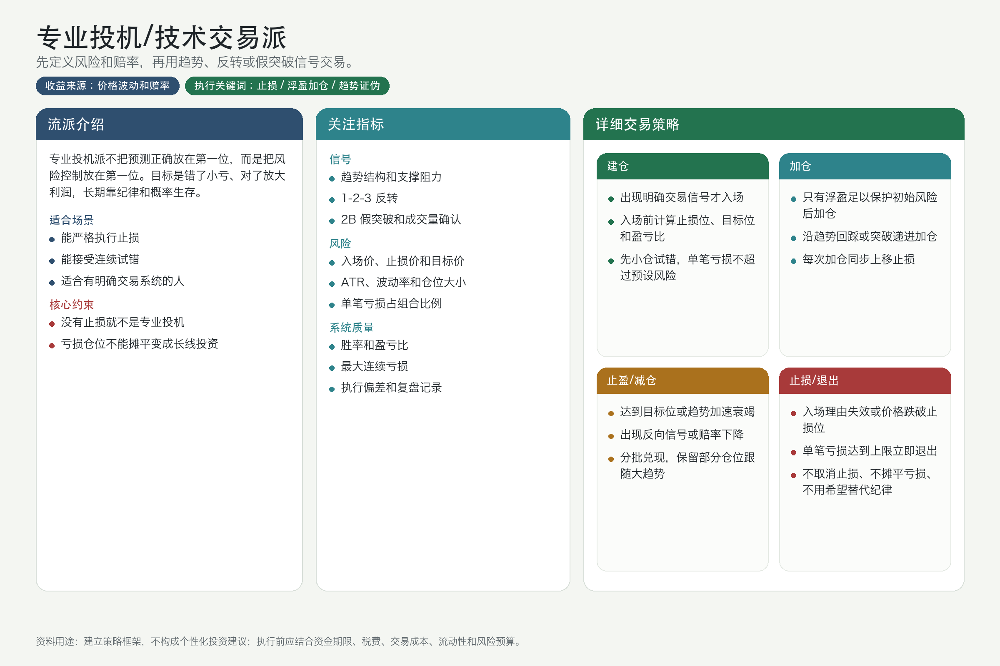

## 第八部分：按自身条件选择流派

| 投资者情况 | 更适合的主框架 | 可选卫星 |
|---|---|---|
| 没时间研究、追求长期简单 | 被动指数派、资产配置派 | 红利、质量、少量主题 |
| 能阅读财报、愿意研究公司 | 价值投资派、质量/护城河派 | 成长、股息 |
| 能承受高波动、理解产业变化 | 成长投资派 | 质量、趋势、主题 ETF |
| 重视现金流和回撤控制 | 股息/现金流派、资产配置派 | 低波动、债券、REITs |
| 擅长规则执行和止损 | 趋势/动量派、专业投机派 | 量化因子、行业轮动 |
| 有数据和编程能力 | 量化/因子派 | 相对价值、趋势 |
| 能深度跟踪交易条款和事件 | 事件驱动派、套利派 | 价值、困境反转 |

### 一个实用组合框架

对多数普通投资者，可以把策略分为三层：

1. 核心层：宽基指数、股债配置、现金管理，承担长期基础收益。
2. 增强层：价值、质量、红利、成长或因子策略，承担风格增强收益。
3. 机会层：行业主题、事件驱动、趋势交易或专业投机，只用较小仓位承担高波动机会。

这个框架的重点不是追求每一层都赚钱，而是让不同策略在不同市场环境中互相补充。

## 第九部分：常见误区

- 把策略名称当成收益保证。
- 用价值投资的理由买入，却用短线技术的情绪卖出。
- 用成长投资的估值买入，却没有持续跟踪增长兑现。
- 看到高股息就认为低风险。
- 把套利当成无风险。
- 因子回测很好看，但忽略真实交易成本和容量。
- 趋势交易没有止损，最后变成长期套牢。
- 宏观判断正确，却低估了市场提前反映和节奏错配。
- 看到网格、做 T 或定投就以为找到了独立流派，没有先判断它服务的收益逻辑。
- 用固定百分比止损套用所有长期投资，或用“逻辑没变”逃避交易策略的价格止损。
- 只看单个持仓风险，不看多个持仓其实都依赖同一个行业、利率或流动性环境。

## 第十部分：参考来源

- Investor.gov, [Beginners' Guide to Asset Allocation, Diversification, and Rebalancing](https://www.investor.gov/additional-resources/general-resources/publications-research/info-sheets/beginners-guide-asset)
- Investor.gov, [Index Funds](https://www.investor.gov/introduction-investing/investing-basics/investment-products/mutual-funds-and-exchange-traded-4)
- Investor.gov, [Stocks - FAQs](https://www.investor.gov/introduction-investing/investing-basics/investment-products/stocks)
- Investor.gov, [Dollar Cost Averaging](https://www.investor.gov/introduction-investing/investing-basics/glossary/all)
- Investor.gov, [Types of Orders](https://www.investor.gov/introduction-investing/investing-basics/how-stock-markets-work/types-orders)
- FINRA, [Order Types](https://www.finra.org/investors/investing/investment-products/stocks/order-types)
- AQR Capital Management, [Understanding Style Premia](https://www.aqr.com/Insights/Research/Journal-Article/Understanding-Style-Premia)
